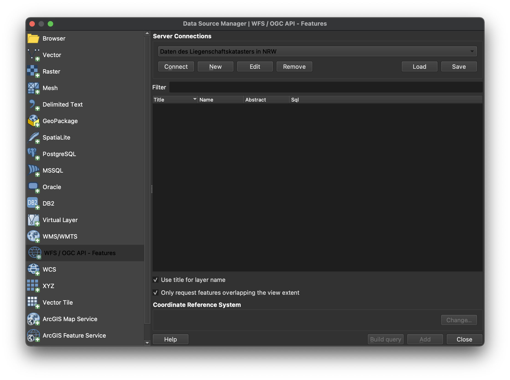
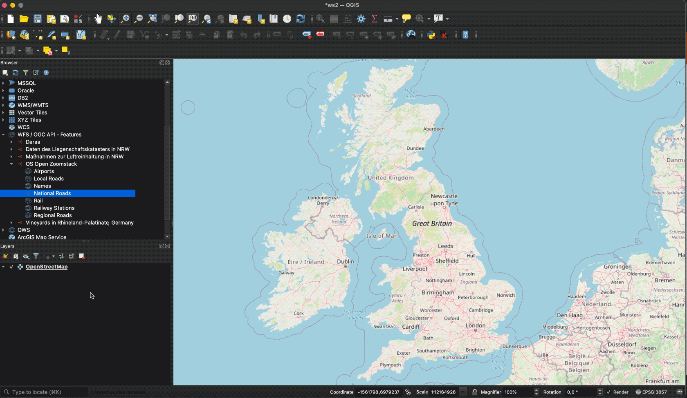

# QGIS

This page shows how to connect with QGIS to an API that implements OGC API - Features - Part 1: Core. 

## Software version

This description uses QGIS 3.16 (LTR).

## Required and supported Conformance classes

The API must support the [Core](http://www.opengis.net/spec/ogcapi-features-1/1.0/conf/core) and [GeoJSON](http://www.opengis.net/spec/ogcapi-features-1/1.0/conf/geojson) conformance classes.

The CRS conformance class from Part 2 (Coordinate Reference Systems by Reference) is not supported. QGIS, however, transforms the WGS84 geometries returned from the API to other coordinate reference systems as needed.

## Steps

### Step 1: Declare the API

Open the Data Source Manager and go to the "WFS / OGC API Features" tab.

Press "New" to open the dialog for a new connections.

Provide the connection information. The URL is the URL of the OGC API Landing Page resource, in this case "https://demo.ldproxy.net/zoomstack". Make sure "Enable feature paging" is checked. 

It is recommended to provide an explicit "Page size" value, if there are more than a handful of features in the dataset. Use a value that is close to maximum value for the `limit` parameter that is specified in the documentation of the API. Otherwise the default value will be used, which often is a low value (e.g., 10) to avoid that API requests unintentionally place a high load on the API.

Then press "OK".

In the Data Source Manager, the new API connection should now be selected. 

### Step 2: Selecting the collections

Press "Connect", the list of collections should now appear.

Select the collections that should be added to the project as a layer and press "Add". 

### Step 3: Use the features

The features from the selected collections should now be added to the map and can be used like other feature data in QGIS. If the number of features in a layer is higher than the page size, the features are progressively loaded page by page.

Note that, if a collection has millions of features and the map view covers the extent of the collection, QGIS will try to load all features. To avoid this, you can, for example, restrict the scale range in which the layer should be visible.

