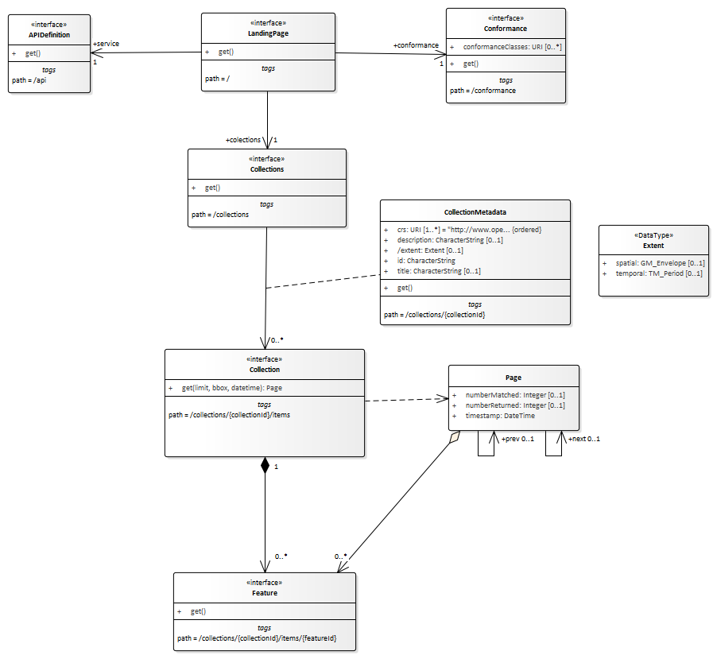

== Requirement Class "Core"

[[core-overview]]
=== Overview

include::requirements/requirements_class_core.adoc[]

Figure 1 illustrates the resources supported by the _Core_ requirements class using
UML. Each resource type available through the server is an «interface».

A server that implements the WFS API provides access to the features in a dataset.
In other words, the API is a distribution of that dataset. A file download, for example,
would be another distribution.

More specifically, each WFS has a single `LandingPage` (path `/`) that provides links to

* the `APIDefinition` (path `/api`),
* the `Conformance` statements (path `/conformance`),
* the `DatasetDistribution` metadata (path `/collections`).

The `APIDefinition` describes the capabilities of the server that can be used by
clients to connect to the server or by development tools to support the
implementation of servers and clients. Accessing the `APIDefinition` using
HTTP GET returns a description of the API.

Accessing the `Conformance` using HTTP GET returns a list of URIs of
requirements classes implemented by the WFS server.

The distribution consists of a set of feature collections. This standard does not
include any requirements about how the features in the dataset have to be aggregated
into collections. A typical approach is to aggregate by feature type but any other approach
that fits the dataset or the applications using this distribution may also be used.

Accessing the `DatasetDistribution` using HTTP GET returns a
`DatasetDistributionResponse`. This response includes a link to each `Collection`
in the distribution along with metadata about each collection including:

* A local identifier for the collection that is unique for the server;
* A list of coordinate reference systems (CRS) in which geometries may be returned by
the server. The first CRS is the default coordinate reference system
(in the _Core_, the default is always WGS 84 with axis order longitude/latitude);
* An optional title and description for the collection;
* An optional extent that can be used to provide an indication of the
spatial and temporal extent of the collection - typically derived from the data.

Each `Collection` (path `/collections/{collection-name}/items`) consists of the features in the collection where each
feature in the distribution is part of exactly one collection.

CAUTION: link:https://github.com/opengeospatial/WFS_FES/issues/30[ISSUE 30] +
Allow also features that do not belong to any collection?

CAUTION: link:https://github.com/opengeospatial/WFS_FES/issues/66[ISSUE 66] +
Support features that do belong to multiple collections?

Accessing a `Collection` using HTTP GET returns a `CollectionResponse`. This
response basically consists of features in the collection. The features included
in the response are determined by the server based on parameters of the request.

A `bbox` or `time` parameter may be used to select only a subset of the features in
the collection (the features that are located in the bounding box or time period).

The `limit` parameter may be used to request only a subset of the
selected features and to indicate that the client wants to page through
the selected features of the collection.

The `CollectionResponse` may include metadata about the number of selected and returned
features (`numberMatched` and `numberReturned`) as well as links to simplify
paging (`next` and `prev`).

Each `Feature` (path `/collections/{collection-name}/items/{feature-id}`)
is also a separate resource and may be requested individually using HTTP GET.

[#img_core,reftext='{figure-caption} {counter:figure-num}']
.Resources in the Core requirements class

CAUTION: link:https://github.com/opengeospatial/WFS_FES/issues/90[ISSUE 90] +
More flexible path structure under `/collections`?

=== API landing page

==== Operation

include::requirements/core/REQ_root-op.adoc[]

==== Response

include::requirements/core/REQ_root-success.adoc[]

CAUTION: link:https://github.com/opengeospatial/WFS_FES/issues/101[ISSUE 101] +
Landing page: Can we reuse existing relation types instead of 'conformance' and 'data'?

.link:https://raw.githubusercontent.com/opengeospatial/WFS_FES/master/core/openapi/schemas/root.yaml[Schema for the landing page]
[source,YAML]
----
type: object
required:
  - links
properties:
  links:
    type: array
    items:
      $ref: https://raw.githubusercontent.com/opengeospatial/WFS_FES/master/core/openapi/schemas/link.yaml
----

.Landing page response document
=================
[source,JSON]
----
{
  "links": [
    { "href": "http://data.example.org/",
      "rel": "self", "type": "application/json", "title": "this document" },
    { "href": "http://data.example.org/api",
      "rel": "service", "type": "application/openapi+json;version=3.0", "title": "the API definition" },
    { "href": "http://data.example.org/conformance",
      "rel": "conformance", "type": "application/json", "title": "WFS 3.0 conformance classes implemented by this server" },
    { "href": "http://data.example.org/collections",
      "rel": "data", "type": "application/json", "title": "Metadata about the feature collections" }
  ]
}
----
=================

==== Error situations

See <<http_status_codes>> for general guidance.

=== API definition

==== Operation

Every WFS provides an API definition that describes the capabilities
of the server and which can be used by developers to understand the API,
by software clients to connect to the server, or
by development tools to support the implementation of servers and clients.

include::requirements/core/REQ_api-definition-op.adoc[]

==== Response

include::requirements/core/REQ_api-definition-success.adoc[]

include::requirements/core/REC_api-definition-oas.adoc[]

If multiple API definition formats are supported by a server, use
content negotiation to select the desired representation.

The API definition document describes the API. In other words,
there is no need to include the `/api` operation in the API definition itself.

The idea is that any WFS can be used by developers that are familiar with
the API definition language(s) supported by the server. For example, if
an OpenAPI definition is used, it should be possible to create a working
client using the OpenAPI definition. The developer may need to learn a little
bit about geometry data types, etc., but it should not be required to read
this standard to access the data via the API.

==== Error situations

See <<http_status_codes>> for general guidance.

=== Declaration of conformance classes

==== Operation

To support "generic" clients for accessing Web Feature Services in general - and
not "just" a specific API / server, the server has to declare the
requirements classes it implements and conforms to.

include::requirements/core/REQ_conformance-op.adoc[]

==== Response

include::requirements/core/REQ_conformance-success.adoc[]

.link:https://raw.githubusercontent.com/opengeospatial/WFS_FES/master/core/openapi/schemas/req-classes.yaml[Schema for the list of requirements classes]
[source,YAML]
----
type: object
required:
  - conformsTo
properties:
  conformsTo:
    type: array
    items:
      type: string
----

.Requirements class response document
=================
This example response in JSON is for a server that supports OpenAPI 3.0 for
the API definition and HTML and GeoJSON as encodings for features.

[source,JSON]
----
{
  "conformsTo": [
    "http://www.opengis.net/spec/wfs-1/3.0/req/core",
    "http://www.opengis.net/spec/wfs-1/3.0/req/oas30",
    "http://www.opengis.net/spec/wfs-1/3.0/req/html",
    "http://www.opengis.net/spec/wfs-1/3.0/req/geojson"
  ]
}
----
=================

==== Error situations

See <<http_status_codes>> for general guidance.

=== HTTP 1.1

include::requirements/core/REQ_http.adoc[]

This includes the correct use of status codes, headers, etc.

CAUTION: link:https://github.com/opengeospatial/WFS_FES/issues/115[ISSUE 115] +
Currently, the Core only requires support for the GET method. Support for
HEAD and OPTIONS for all resources should be considered, too.

[[http_status_codes]]
==== HTTP status codes

<<status_codes>> lists the main HTTP status codes that clients should be
prepared to receive.

This includes, for example, support for specific security schemes or URI
redirection.

In addition, other error situations may occur in the transport layer
outside of the server.

[#status_codes,reftext='{table-caption} {counter:table-num}']
.Typical HTTP status codes
[cols="15,85",options="header"]
!===
|Status code |Description
|`200` |A successful request.
|`304` |An <<web_caching,entity tag was provided in the request>> and the resource has not been changed since the previous request.
|`400` |The server cannot or will not process the request due to an apparent client error. For example, a query parameter had an incorrect value.
|`401` |The request requires user authentication. The response includes a `WWW-Authenticate` header field containing a challenge applicable to the requested resource.
|`403` |The server understood the request, but is refusing to fulfill it. While status code `401` indicates missing or bad authentication, status code `403` indicates that authentication is not the issue, but the client is not authorised to perform the requested operation on the resource.
|`404` |The requested resource does not exist on the server. For example, a path parameter had an incorrect value.
|`405` |The request method is not supported. For example, a POST request was submitted, but the resource only supports GET requests.
|`406` |The `Accept` header submitted in the request did not support any of the media types supported by the server for the requested resource.
|`500` |An internal error occurred in the server.
!===

More specific guidance is provided for each resource, where applicable.

include::requirements/core/PER_additional-status-codes.adoc[]

[[web_caching]]
=== Web caching

Entity tags are a mechanism for web cache validation and for supporting conditional
requests to reduce network traffic. Entity tags are specified by <<rfc2616,HTTP/1.1 (RFC 2616)>>.

include::requirements/core/REC_etag.adoc[]

CAUTION: link:https://github.com/opengeospatial/WFS_FES/issues/38[ISSUE 38] +
More detail / examples on caching. Add an example OpenAPI operation (headers,
response codes) - here or in clause 9.

[[cross_origin]]
=== Support for cross-origin requests

Access to data from a HTML page is by default prohibited for security reasons,
if the data is located on another host than the webpage ("same-origin policy").
A typical example is a web-application accessing feature data from
multiple distributed datasets.

include::requirements/core/REC_cross-origin.adoc[]

Two common mechanisms to support cross-origin requests are:

* link:https://en.wikipedia.org/wiki/Cross-origin_resource_sharing[Cross-origin resource sharing (CORS)]
* link:https://en.wikipedia.org/wiki/JSONP[JSONP (JSON with padding)]

=== Encodings

While the WFS 3.0 standard does not specify any mandatory encoding, we recommend
the following encodings. See <<overview,Clause 6 (Overview)>> for a discussion.

include::requirements/core/REC_html.adoc[]

include::requirements/core/REC_geojson.adoc[]

<<_http_1_1,Requirement `/req/core/http`>> implies that the encoding of a server response
is determined using content negotiation as specified by the HTTP RFC.

The section <<mediatypes,Media Types>> includes guidance on media types for
<<encodings,encodings>> that are specified in this document.

Note that any server that supports multiple encodings will have to support
a mechanism to mint encoding-specific URIs for resources in order to express
links, for example, to alternate representations of the same resource. This
document does not mandate any particular approach how this is supported by
the server.

As clients simply need to dereference the URI of the link, the
implementation details and the mechanism how the encoding is included in
the URI of the link are not important. Developers interested in the
approach of a particular implementation, for example, to manipulate ("hack")
URIs in the browser address bar, can study the API definition.

[NOTE]
=====================================================================
Two common approaches are:

* an additional path for each encoding of each resource (this can be expressed,
for example, using format specific suffixes like ".html");
* an additional query parameter (for example, "accept" or "f") that overrides
the Accept header of the HTTP request.
=====================================================================

=== Coordinate reference systems

As discussed in Chapter 9 of the <<SDWBP,W3C/OGC Spatial Data on the Web Best Practices document>>,
how to express and share the location of features in a consistent way is one
of the most fundamental aspects of publishing geographic data and it is important
to be clear about the coordinate reference system that coordinates are in.

For the reasons discussed in the Best Practices, Web Feature Service 3.0 uses
WGS84 longitude and latitude as the default coordinate reference system.

include::requirements/core/REQ_crs84.adoc[]

The implementations compliant with the Core are not required to support
publishing feature geometries in coordinate reference systems other than
http://www.opengis.net/def/crs/OGC/1.3/CRS84.
The Core also does not specify a capability to request feature geometries in a different
coordinate reference system than the native one of the published features.
Such a capability will be specified in another part(s)
of the WFS 3.0 series.

=== Link headers

include::requirements/core/REC_link-header.adoc[]

=== Feature collections metadata

==== Operation

include::requirements/core/REQ_fc-md-op.adoc[]

==== Response

include::requirements/core/REQ_fc-md-success.adoc[]

.link:https://raw.githubusercontent.com/opengeospatial/WFS_FES/master/core/openapi/schemas/content.yaml[Schema for the metadata about feature collections]
[source,YAML]
----
type: object
required:
  - links
  - collections
properties:
  links:
    type: array
    items:
      $ref: https://raw.githubusercontent.com/opengeospatial/WFS_FES/master/core/openapi/schemas/link.yaml
  collections:
    type: array
    items:
      $ref: https://raw.githubusercontent.com/opengeospatial/WFS_FES/master/core/openapi/schemas/collectionInfo.yaml
----

include::requirements/core/REQ_fc-md-links.adoc[]

include::requirements/core/REC_fc-md-descriptions.adoc[]

CAUTION: link:https://github.com/opengeospatial/WFS_FES/issues/56[ISSUE 56] +
Lack of DescribeFeatureType request

CAUTION: link:https://github.com/opengeospatial/WFS_FES/issues/102[ISSUE 102] +
Add a recommendation about a link to the dataset metadata (for example, in DCAT).
Which link relation type?

include::requirements/core/REQ_fc-md-items.adoc[]

include::requirements/core/REQ_fc-md-items-links.adoc[]

CAUTION: link:https://github.com/opengeospatial/WFS_FES/issues/103[ISSUE 103] +
Can/should we make use of the new
link:https://github.com/OAI/OpenAPI-Specification/blob/master/versions/3.0.1.md#linkObject[Link Object]
in OpenAPI 3.0?

include::requirements/core/REQ_fc-md-extent.adoc[]

.link:https://raw.githubusercontent.com/opengeospatial/WFS_FES/master/core/openapi/schemas/collectionInfo.yaml[Schema for the metadata about a feature collection]
[source,YAML]
----
type: object
required:
  - name
  - links
properties:
  name:
    description: identifier of the collection used, for example, in URIs
    type: string
  title:
    description: human readable title of the collection
    type: string
  description:
    description: a description of the features in the collection
    type: string
  links:
    type: array
    items:
      $ref: https://raw.githubusercontent.com/opengeospatial/WFS_FES/master/core/openapi/schemas/link.yaml
  extent:
    $ref: https://raw.githubusercontent.com/opengeospatial/WFS_FES/master/core/openapi/schemas/extent.yaml
  crs:
    description: the list of coordinate reference systems supported by the service; the first item is the default coordinate reference system
    type: array
    items:
      type: string
    default:
      - http://www.opengis.net/def/crs/OGC/1.3/CRS84
----

NOTE: The `crs` property is not used by this conformance class, but reserved for future use.

.Feature collection metadata response document
=================
This feature collection metadata example response in JSON is for a dataset with
a single collection "buildings". It includes links to the collection resource in all formats that
are supported by the service (link:https://www.iana.org/assignments/link-relations/link-relations.xhtml[link relation type]: "item").

Representations of the metadata resource in other formats are referenced using link:https://www.iana.org/assignments/link-relations/link-relations.xhtml[link relation type] "alternate".

Additional links to a GML application schema for the building data and to
a web page that has additional information about buildings are provided using link:https://www.iana.org/assignments/link-relations/link-relations.xhtml[link relation type] "describedBy".

Coordinate reference system information is not provided as the service provides
geometries only in the default system (WGS84 longitude/latitude).

[source,JSON]
----
{
  "links": [
    { "href": "http://data.example.org/collections.json",
      "rel": "self", "type": "application/json", "title": "this document" },
    { "href": "http://data.example.org/collections.html",
      "rel": "alternate", "type": "text/html", "title": "this document as HTML" },
    { "href": "http://schemas.example.org/1.0/foobar.xsd",
      "rel": "describedBy", "type": "application/xml", "title": "XML schema for Acme Corporation data" }
  ],
  "collections": [
    {
      "name": "buildings",
      "title": "Buildings",
      "description": "Buildings in the city of Bonn.",
      "extent": {
        "spatial": [ 7.01, 50.63, 7.22, 50.78 ],
        "temporal": [ "2010-02-15T12:34:56Z", "2018-03-18T12:11:00Z" ]
      },
      "links": [
        { "href": "http://data.example.org/collections/buildings/items",
          "rel": "item", "type": "application/geo+json",
          "title": "Buildings" },
        { "href": "http://example.org/concepts/building.html",
          "rel": "describedBy", "type": "text/html",
          "title": "Feature catalogue for buildings" }
      ]
    }
  ]
}
----
=================

==== Error situations

See <<http_status_codes>> for general guidance.

=== Feature collection metadata

==== Operation

include::requirements/core/REQ_sfc-md-op.adoc[]

==== Response

include::requirements/core/REQ_sfc-md-success.adoc[]

==== Error situations

See <<http_status_codes>> for general guidance.

If the parameter `name` does not exist on the server, the status code of the
response will be `404` (see <<status_codes>>).

=== Feature collections

==== Operation

include::requirements/core/REQ_fc-op.adoc[]

==== Parameter limit

include::requirements/core/REQ_fc-limit-definition.adoc[]

include::requirements/core/PER_fc-limit-default-maximum.adoc[]

include::requirements/core/REQ_fc-limit-response-1.adoc[]

include::requirements/core/PER_fc-limit-response-2.adoc[]

A template for the definition of the parameter in YAML according to
OpenAPI 3.0 is available at
link:https://raw.githubusercontent.com/opengeospatial/WFS_FES/master/core/openapi/parameters/limit.yaml[limit.yaml].

==== Parameter bbox

include::requirements/core/REQ_fc-bbox-definition.adoc[]

include::requirements/core/REQ_fc-bbox-response.adoc[]

"Intersects" means that the rectangular area specified in the parameter
`bbox` includes a coordinate that is part of the (spatial) geometry of the feature.
This includes the boundaries of the geometries (e.g. for curves the start
and end position and for surfaces the outer and inner rings).

This standard does not specify requirements for the parameter `bbox-crs`. Those
requirements will be specified in an additional part of the WFS 3.0 series.

For WGS84 longitude/latitude the bounding box is in most cases the sequence of
minimum longitude, minimum latitude, maximum longitude and maximum latitude.
However, in cases where the box spans the anti-meridian the first value
(west-most box edge) is larger than the third value (east-most box edge).

.The bounding box of the New Zealand Exclusive Economic Zone
=================
The bounding box of the New Zealand Exclusive Economic Zone in WGS84 (from 160.6°E to 170°W and from 55.95°S to 25.89°S)
would be represented in JSON as `[ 160.6, -55.95, -170, -25.89 ]` and in a query as `bbox=160.6,-55.95,-170,-25.89`.
=================

A template for the definition of the parameter in YAML according to
OpenAPI 3.0 is available at
link:https://raw.githubusercontent.com/opengeospatial/WFS_FES/master/core/openapi/parameters/bbox.yaml[bbox.yaml].

==== Parameter time

include::requirements/core/REQ_fc-time-definition.adoc[]

include::requirements/core/REQ_fc-time-response.adoc[]

"Intersects" means that the time (instant or period) specified in the parameter
`time` includes a timestamp that is part of the temporal geometry of the feature
(again, a time instant or period). For time periods this includes the start
and end time.

.A date-time
=================
February 12, 2018, 23:20:52 GMT:

`time=2018-02-12T23%3A20%3A52Z`
=================

For features with a temporal property that is a timestamp (like `lastUpdate`
in the building features), a date-time value would match all features where
the temporal property is identical.

For features with a temporal property that is a date or a time period,
a date-time value would match all features where the timestamp is on that
day or within the time period.

.A period using a start and end time
=================
February 12, 2018, 00:00:00 GMT to March 18, 2018, 12:31:12 GMT:

`time=2018-02-12T00%3A00%3A00Z%2F2018-03-18T12%3A31%3A12Z`
=================

.A period using start time and a duration
=================
A duration of 1 month, 6 days, 12 hours, 31 minutes and 12 seconds from
February 12, 2018, 00:00:00 GMT:

`time=2018-02-12T00%3A00%3A00Z%2FP1M6DT12H31M12S`
=================

For features with a temporal property that is a timestamp (like `lastUpdate`
in the building features), a time period would match all features where
the temporal property is within the period.

For features with a temporal property that is a date or a time period,
a time period would match all features where the values overlap.

A template for the definition of the parameter in YAML according to
OpenAPI 3.0 is available at
link:https://raw.githubusercontent.com/opengeospatial/WFS_FES/master/core/openapi/parameters/time.yaml[time.yaml].

==== Parameters for filtering on feature properties

include::requirements/core/REC_fc-filters.adoc[]

.An additional parameter to filter buildings based on their function
=================
[source,YAML]
----
name: function
in: query
description: >-
  Only return buildings of a particular function.\

  Default = return all buildings.
required: false
schema:
  type: string
  enum:
    - residential
    - commercial
    - public use
style: form
explode: false
example: 'function=public+use'
----
=================

.An additional parameter to filter buildings based on their name
=================
[source,YAML]
----
name: name
in: query
description: >-
  Only return buildings with a particular name. Use '*' as a wildcard.\

  Default = return all buildings.
required: false
schema:
  type: string
style: form
explode: false
example: 'name=A*'
----

For string-valued properties, servers could support wildcard searches. The
example included in the OpenAPI fragment would search for all buildings with
a name that starts with "A".
=================

CAUTION: link:https://github.com/opengeospatial/WFS_FES/issues/20[ISSUE 20] +
Query parameter name collisions.

==== Response

include::requirements/core/REQ_fc-response.adoc[]

The number of features returned depends on the server and the parameter `limit`:

* The client can request a limit it is interested in.
* The server likely has a default value for the limit, and a maximum limit.
* If the server has any more results available than it returns (the
number it returns is less than or equal to the requested/default/maximum limit)
then the server will include a link to the next set of results.

So (using the default/maximum values of 10/10000 from the OpenAPI
fragment in requirement `/req/core/fc-limit-definition`):

* If you ask for 10, you will get 0 to 10 (as requested) and if there are more a `next` link;
* If you don't specify a limit, you will get 0 to 10 (default) and if there are more a `next` link;
* If you ask for 50000, you might get up to 10000 (server-limited) and if there are more a `next` link;
* If you follow the next link from the previous response, you might get up to 10000 additional features and if there are more a `next` link.

include::requirements/core/REQ_fc-links.adoc[]

include::requirements/core/REC_fc-next-1.adoc[]

include::requirements/core/REC_fc-next-2.adoc[]

include::requirements/core/REC_fc-next-3.adoc[]

This document does not mandate any specific implementation approach for
the `next` links.

An implementation could use opaque links that are managed by the server.
It is up to the server to determine how long these links can be de-referenced.
Clients should be prepared to receive a 404 response.

Another implementation approach is to use an implementation-specific parameter
like the `startIndex` parameter that was used in previous versions of WFS (and
which may be added again in an extension to this specification).

include::requirements/core/PER_fc-prev.adoc[]

Providing `prev` links supports navigating back and forth between pages,
but depending on the implementation approach it may be too complex to implement.

include::requirements/core/REQ_fc-rel-type.adoc[]

include::requirements/core/REQ_fc-timestamp.adoc[]

include::requirements/core/REQ_fc-numberMatched.adoc[]

include::requirements/core/REQ_fc-numberReturned.adoc[]

CAUTION: Related to link:https://github.com/opengeospatial/WFS_FES/issues/8[ISSUE 8] +
Define these as headers or include them in the payload? `timeStamp`, for example, may
not be needed given the 'Date' HTTP header. For `numberMatched` and
`numberReturned` headers do not seem to be a good idea as, for example,
`numberReturned` can only be included at the end, if streaming is used.

NOTE: The representation of the links and the other properties in the payload
depends on the encoding of the feature collection.

.Links
=================
If the request is to return building features and "10" is the default `limit`,
the links in the response could be (in this example represented as link headers
and using an additional parameter `startIndex` to implement `next` links - and
the optional `prev` links):

[source]
----
Link: <http://data.example.org/collections/buildings/items.json>; rel="self"; type="application/geo+json"
Link: <http://data.example.org/collections/buildings/items.html>; rel="alternate"; type="text/html"
Link: <http://data.example.org/collections/buildings/items.json?startIndex=10>; rel="next"; type="application/geo+json"
----

Following the `next` link could return:

[source]
----
Link: <http://data.example.org/collections/buildings/items.json?startIndex=10>; rel="self"; type="application/geo+json"
Link: <http://data.example.org/collections/buildings/items.html?startIndex=10>; rel="alternate"; type="text/html"
Link: <http://data.example.org/collections/buildings/items.json?startIndex=0>; rel="prev"; type="application/geo+json"
Link: <http://data.example.org/collections/buildings/items.json?startIndex=20>; rel="next"; type="application/geo+json"
----

If an explicit `limit` of "50" is used, the links in the response could be:

[source]
----
Link: <http://data.example.org/collections/buildings/items.json?limit=50>; rel="self"; type="application/geo+json"
Link: <http://data.example.org/collections/buildings/items.html?limit=50>; rel="alternate"; type="text/html"
Link: <http://data.example.org/collections/buildings/items.json?limit=50&startIndex=50>; rel="next"; type="application/geo+json"
----

Following the `next` link could return:

[source]
----
Link: <http://data.example.org/collections/buildings/items.json?limit=50&startIndex=50>; rel="self"; type="application/geo+json"
Link: <http://data.example.org/collections/buildings/items.html?limit=50&startIndex=50>; rel="alternate"; type="text/html"
Link: <http://data.example.org/collections/buildings/items.json?limit=50&startIndex=0>; rel="prev"; type="application/geo+json"
Link: <http://data.example.org/collections/buildings/items.json?limit=50&startIndex=100>; rel="next"; type="application/geo+json"
----
=================

==== Error situations

See <<http_status_codes>> for general guidance.

If the path parameter `name` does not exist on the server, the status code of the
response will be `404`.

A `400` will be returned in the following situations:

* If query parameter `limit` is not an integer or not between minimum and maximum;
* if query parameter `bbox` does not have 4 (or 6) numbers or they do not form
a bounding box;
* if parameter `time` is not a valid time stamp or time period.

=== Feature

==== Operation

include::requirements/core/REQ_f-op.adoc[]

include::requirements/core/PER_f-id.adoc[]

CAUTION: link:https://github.com/opengeospatial/WFS_FES/issues/47[ISSUE 47] +
There are two types of feature identifiers and we need to make sure we
distinguish between them.

==== Response

include::requirements/core/REQ_f-success.adoc[]

include::requirements/core/REQ_f-links.adoc[]

NOTE: The representation of the links in the payload will depend on the encoding
of the feature.

.Links
=================
The links in a feature could be (in this example represented as link headers):

[source]
----
Link: <http://data.example.org/collections/buildings/items/123.json>; rel="self"; type="application/geo+json"
Link: <http://data.example.org/collections/buildings/items/123.html>; rel="alternate"; type="text/html"
Link: <http://data.example.org/collections/buildings/items.json>; rel="collection"; type="application/geo+json"
----
=================

==== Error situations

See <<http_status_codes>> for general guidance.

If the path parameter `name` or the path parameter `id` does not exist on
the server, the status code of the response will be `404`.
