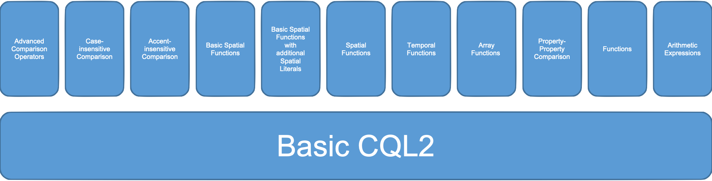

# Common Query Language (CQL2)

This folder contains the content for the candidate standard [Common Query Language (CQL2)](https://docs.ogc.org/DRAFTS/21-065.html).

## Status

The candidate standard has been split from [OGC API - Features - Part 3: Filtering](https://docs.ogc.org/DRAFTS/19-079r1.html) after the [OGC public comment period](https://www.ogc.org/standards/requests/229), because CQL2 is a separate building block that can also be used independent of the OGC API standards. No technical changes were introduced by the split.

All CQL2 issues are managed in a [GitHub project board](https://github.com/opengeospatial/ogcapi-features/projects/4) together with the issues for Part 3.

## Overview

CQL2 supports filter predicates for standard data types like strings, numbers and boolean as well as for spatial geometries (point, lines, polygons) and temporal geometries (instants and intervals). Every CQL2 implementation must support a subset of CQL2 ("Basic CQL2") with more advanced capabilities (array operators, temporal operators, spatial operators, functions, arithmetic expressions) in separate conformance classes that can be supported as needed. The conformance classes supported by an API can be determined by inspecting the [Conformance Declaration](http://www.opengis.net/doc/IS/ogcapi-features-1/1.0#_declaration_of_conformance_classes).

A simple example: Select all roads (attribute F_CODE is AP030) that are motorways (attribute RTY is 1 or 2) that have been changed (attribute ZI001_SDV) after 2011. Filter expression in CQL2 Text: [`F_CODE='AP030' AND RTY IN (1,2) AND T_AFTER(ZI001_SDV, TIMESTAMP('2011-12-31T23:59:59Z'))`](https://demo.ldproxy.net/daraa/collections/TransportationGroundCrv/items?filter=F_CODE%3D%27AP030%27%20AND%20ZI001_SDV%20AFTER%202011-12-31T23%3A59%3A59Z%20AND%20RTY%20IN%20(1%2C2)).

Examples for CQL2 expressions in both CQL2 Text and CQL2 JSON are available in the [examples folder](standard/schema/examples).
