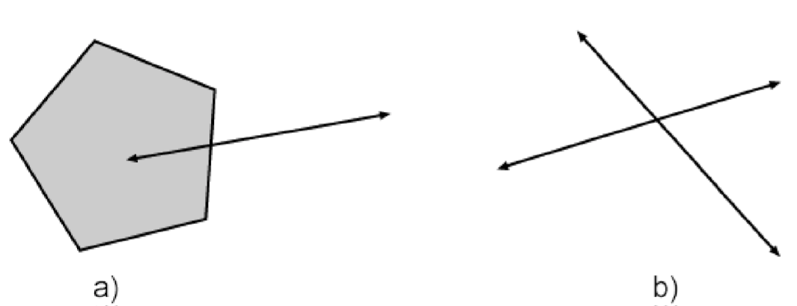
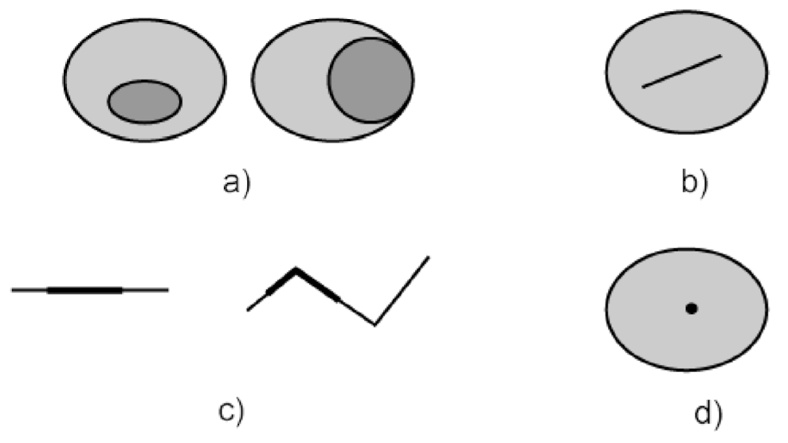

[[cql2-enhancements]]
== Common Query Language enhancements

=== Overview

This clause specifies requirements for enhancements to <<cql2-core,Basic CQL2>>.
Specifically, this clause defines requirements for:

* Advanced comparison operators;
* Case-insensitive comparison;
* Spatial operators;
* Temporal operators;
* Array operators;
* Property-property and literal-literal comparisons;
* Support for functions in CQL2;
* Support for arithmetic expression in CQL2;

In each case, this clause specifies requirements for the rules in <<cql2-bnf>>
not supported by Basic CQL2.

[[advanced-comparison-operators]]
=== Requirements Class "Advanced Comparison Operators"

include::requirements/requirements_class_advanced_comparison_operators.adoc[]

This requirements class adds support for the operators LIKE, BETWEEN and IN.

include::requirements/advanced-comparison-operators/REQ_like-predicate.adoc[]

include::recommendations/advanced-comparison-operators/PER_like-predicate.adoc[]

[[example_7_1]]
.Example of a LIKE predicate
====
----
name LIKE 'Smith%' 
----

[source,JSON]
----
{"like": [ { "property": "name" }, "Smith%" ] }
----
====

include::requirements/advanced-comparison-operators/REQ_between-predicate.adoc[]

include::recommendations/advanced-comparison-operators/PER_between-predicate.adoc[]

[[example_7_2]]
.Examples of a BETWEEN predicate
====
----
depth BETWEEN 100.0 and 150.0
----

[source,JSON]
----
{
  "between": {
     "value": { "property": "depth" },
     "lower": 100.0,
     "upper": 150.0
  }
}
----
====

include::requirements/advanced-comparison-operators/REQ_in-predicate.adoc[]

include::recommendations/advanced-comparison-operators/PER_in-predicate.adoc[]

[[example_7_3]]
.Examples of a IN predicate
====
----
cityName IN ('Toronto','Frankfurt','Tokyo','New York')
----

[source,JSON]
----
{
  "in": {
     "value": { "property": "cityName" },
     "list": [ "Toronto", "Frankfurt", "Tokyo", "New York" ]
  }
}
----

----
category NOT IN (1,2,3,4)
----

[source,JSON]
----
{
  "not": {
    "in": {
       "value": { "property": "category" },
       "list": [ 1, 2, 3, 4 ]
    }
  }
}
----
====

[[accent-case-insensitive-comparison]]
=== Requirements Class "Accent and Case-insensitive Comparison"

include::requirements/requirements_class_accent-case-insensitive-comparison.adoc[]

This requirements class adds support for case-insensitive string comparisons.

include::requirements/accent-case-insensitive-comparison/REQ_casei-builtin-function.adoc[]

[[example_7_4_casei]]
.Example case-insensitive comparison
====

----
CASEI(road_class) IN (CASEI('Οδος'),CASEI('Straße'))
----

[source,JSON]
----
{
  "in": [
    { "function": { "name": "casei", "arguments": ["road_class"] } },
    [
      { "function": { "name": "casei", "arguments": ["Οδος"] } },
      { "function": { "name": "casei", "arguments": ["Straße"] } }
    ]
  ]
}
----
====

This requirements class adds support for accent-insensitive string comparisons.

include::requirements/accent-case-insensitive-comparison/REQ_accenti-builtin-function.adoc[]

[[example_7_4_accenti]]
.Example accent-insensitive comparison
====

----
etat_vol = ACCENTI('débárquér')
----

[source,JSON]
----
{
  "op": "=",
  "args": [
     { "property": "etat" },
     { "function": { "name": "accenti", "args": ["débárquér"] } },
  ]
}
----
====

[[basic-spatial-operators]]
=== Requirements Class "Basic Spatial Operators"

include::requirements/requirements_class_basic-spatial-operators.adoc[]

A _spatial predicate_ evaluates two geometry-valued expressions to determine if the expressions satisfy the requirements of the specified spatial operator.

In this conformance class, the only required spatial operator is _intersects_. Additional spatial operators are specified in the <<rc_spatial-operators,Spatial Operators>> requirements class.

include::requirements/basic-spatial-operators/REQ_spatial-predicate.adoc[]

include::requirements/basic-spatial-operators/REQ_spatial-operators.adoc[]

include::recommendations/basic-spatial-operators/PER_spatial-predicates.adoc[]

CQL2 uses Well-Known Text (WKT) or GeoJSON to encode geometry literals. Since WKT and GeoJSON do not provide a capability to specify the CRS of a geometry literal, the server has to determine the CRS of the geometry literals in a filter expression through another mechanism. For example, a query parameter `filter-crs` is used in <<OGCFeat-3,OGC API - Features - Part 3: Filtering>> to pass the CRS information to the server.

[[example_7_5]]
.Example spatial predicate
====
----
S_INTERSECTS(geometry,POLYGON((36.319836 32.288087,36.320041 32.288032,36.320210 32.288402,36.320008 32.288458,36.319836 32.288087)))
----

[source,JSON]
----
{ "s_intersects": [
   { "property": "geometry" },
   {
      "type": "Polygon",
      "coordinates": [
         [
            [36.319836, 32.288087],
            [36.320041, 32.288032],
            [36.320210, 32.288402],
            [36.320008, 32.288458],
            [36.319836, 32.288087]
         ]
      ]
   }
] }
----
====

[[example_7_6]]
.Example for the filter-crs query parameter
====
----
...filter-lang=cql2-text&
   filter-crs=http://www.opengis.net/def/crs/EPSG/0/32635&
   filter=S_INTERSECTS(geometry,POLYGON((379213.87 3610774.16,379233.84 3610769.70,379246.15 3610812.39,379226.49 3610816.88,379213.87 3610774.16)))...
----

Note that the values of the `filter-crs` and `filter` parameters have not been percent-encoded (see section 2.1 of <<rfc3986,RFC 3986>>) in this example for better readability.
====

[[spatial-operators]]
=== Requirements Class "Spatial Operators"

include::requirements/requirements_class_spatial-operators.adoc[]

This requirement adds a set of Dimensionally Extended Nine-intersection Model (DE-9IM) relation operators that may be used to add spatial predicates to a CQL2 filter expression.

include::requirements/spatial-operators/REQ_spatial-operators.adoc[]

The following table lists the mathematical definitions of each spatial operator as described in <<ogc06-103r4,OpenGIS® Implementation Standard for Geographic information - Simple feature access - Part 1: Common architecture>>.

[reftext='{table-caption} {counter:table-num}']
.Mathematical definitions of spatial operators
[width=100%,cols="30,70",options="header"]
|===
|Spatial operator |Definition
|S_CONTAINS |S_CONTAINS(a,b) &#x2b04; b CONTAINS a
|S_CROSSES |S_CROSSES(a,b) &#x2b04; [I(a) &#x2229; I(b) = &#x2205;) &#x2227; (a &#x2229; b &#x2260; a) &#x2227; (a &#x2229; b &#x2260; b)]
|S_DISJOINT |S_DISJOINT(a,b) &#x2b04; a &#x2229; b = &#x2205;
|S_EQUALS |S_EQUALS(a,b) &#x2b04; a &#x2286; b &#x2227; b &#x2286; a
|S_INTERSECTS |S_INTERSECTS(a,b) &#x2b04; ! a DISJOINT b
|S_OVERLAPS |S_OVERLAPS(a,b) &#x2b04; (dim(I(a)) = dim(I(b)) = dim(I(a) &#x2229; I(b))) &#x2227; (a &#x2229; b &#x2260; a) &#x2227; (a &#x2229; b &#x2260; b)
|S_TOUCHES |S_TOUCHES(a,b) &#x2b04; (I(a) &#x2229; I(b) = &#x2205;) &#x2227; (a &#x2229; b) &#x2260; &#x2205;
|S_WITHIN |S_WITHIN(a,b) &#x2b04; (a &#x2229; b = a) &#x2227; (I(a) &#x2229; E(b) &#x2260; &#x2205;)
|===

The following diagrams illustrate the meaning of the `S_CROSSES`, `S_OVERLAPS`, `S_TOUCHES` and `S_WITHIN` operators.

[#figure4]
.Examples of the S_CROSSES relationship Polygon/LineString(a) and LineString/LineString(b).

[#figure3]
.Examples of the S_OVERLAPS relationship Polygon/LineString(a) and LineString/LineString(b).
image::images/overlaps.png[alt=Overlaps,width=70%]

[#figure1]
.Examples of the S_TOUCHES relationship
image::images/touches.png[alt=Touches,width=70%]

[#figure2]
.Examples of the S_WITHIN relationship Polygon/Polygon(a), Polygon/LineString(b), LineString/LineString(c), and Polygon/Point(d)

NOTE: If geometry *_a_* `S_CONTAINS` geometry *_b_*, then geometry *_b_* is `S_WITHIN` geometry *_a_*.

[[example_7_7]]
.Example of a spatial relationship between a property and a literal geometry.
====
----
S_CROSSES(road,POLYGON((43.7286 -79.2986, 43.7311 -79.2996, 43.7323 -79.2972,
                        43.7326 -79.2971, 43.7350 -79.2981, 43.7350 -79.2982,
                        43.7352 -79.2982, 43.7357 -79.2956, 43.7337 -79.2948,
                        43.7343 -79.2933, 43.7339 -79.2923, 43.7327 -79.2947,
                        43.7320 -79.2942, 43.7322 -79.2937, 43.7306 -79.2930,
                        43.7303 -79.2930, 43.7299 -79.2928, 43.7286 -79.2986)))
----

[source,JSON]
----
{
   "s_crosses": [
      {"property": "road"},
      {
         "type": "Polygon",
         "coordinates": [
            [43.7286,-79.2986], [43.7311,-79.2996], [43.7323,-79.2972],
            [43.7326,-79.2971], [43.7350,-79.2981], [43.7350,-79.2982],
            [43.7352,-79.2982], [43.7357,-79.2956], [43.7337,-79.2948],
            [43.7343,-79.2933], [43.7339,-79.2923], [43.7327,-79.2947],
            [43.7320,-79.2942], [43.7322,-79.2937], [43.7306,-79.2930],
            [43.7303,-79.2930], [43.7299,-79.2928], [43.7286,-79.2986]
         ]
      }
   ]
}
----
====

[[temporal-operators]]
=== Requirements Class "Temporal Operators"

include::requirements/requirements_class_temporal-operators.adoc[]

A temporal predicate evaluates two time-valued expressions to determine, if the expressions satisfy the requirements of the specified temporal operator.

The operands in a temporal predicate are temporal geometries. A temporal geometry is either an instant or an interval.

An instant is either a date or a timestamp in accordance with <<rfc3339,RFC 3339>> (rules `full-date` or `date-time`). Note that since time is continuous, every instant has a duration and a start/end. Nevertheless, the geometry can be considered an instant in the temporal resolution that is applicable for the specific property.

An interval is the time between a start instant and an end instant, including both bounding instances.

CQL2 follows ISO 8601-1/ISO 8601-2 in defining intervals as closed at both start and end. Note that some implementations and other specifications use a different definition and it may be necessary to convert between the interval representations. For example, SQL uses half-closed intervals - closed at the start, open at the end.

Depending on the implementation environment, the underlying datastore may or may not support intervals as data types of properties. If not, intervals are typically represented by two separate properties that are instants, one for the start and one for the end of the interval.

All temporal geometries are in the Gregorian Calendar. This is a deliberate restriction to keep implementations of CQL2 simple, avoiding requirements to transform time instants to other temporal coordinate reference systems, but still cover a large number of use cases. This is consistent with the use of RFC 3339 as a key standard for expressing date and time on the internet, including in the OGC API standards.

The temporal operators in CQL2 are based on the definitions in the <<owl-time,W3C/OGC Time Ontology in OWL>>. 

NOTE: <<per_basic-cql2_time-instant-comparison,Simple temporal prediates>> involving time instants can also be evaluated using the <<basic-cql2_comparison-predicates,standard comparison operators>>.

The following table specifies the definition of the temporal operators where both operands may be instants or intervals, including mixed combinations.

[[temporal-operators-1]]
[reftext='{table-caption} {counter:table-num}']
.Definitions of temporal operators that support both instants and intervals
[width=100%,cols="30,70",options="header"]
|===
|Temporal operator |Definition (t1: first operand, t2: second operand)
|T_AFTER |See https://www.w3.org/TR/owl-time/#time:after[after] 
|T_BEFORE |See https://www.w3.org/TR/owl-time/#time:before[before] 
|T_DISJOINT |(t1 T_BEFORE t2) OR (t1 T_AFTER t2)
|T_EQUALS |Start and end of t1 and t2 are coincident
|T_INTERSECTS |NOT (t1 T_DISJOINT t2)
|===

Additional temporal operators are available, but only applicable for intervals. Using these operators with instants will result in a client error.

[[temporal-operators-2]]
[reftext='{table-caption} {counter:table-num}']
.Definitions of temporal operators between intervals
[width=100%,cols="30,70",options="header"]
|===
|Temporal operator |Definition
|T_CONTAINS |See https://www.w3.org/TR/owl-time/#time:intervalContains[intervalContains]
|T_DURING |See https://www.w3.org/TR/owl-time/#time:intervalDuring[intervalDuring]
|T_FINISHEDBY |See https://www.w3.org/TR/owl-time/#time:intervalFinishedBy[intervalFinishedBy]
|T_FINISHES |See https://www.w3.org/TR/owl-time/#time:intervalFinishes[intervalFinishes]
|T_MEETS |See https://www.w3.org/TR/owl-time/#time:intervalMeets[intervalMeets]
|T_METBY |See https://www.w3.org/TR/owl-time/#time:intervalMetBy[intervalMetBy]
|T_OVERLAPPEDBY |See https://www.w3.org/TR/owl-time/#time:intervalOverlappedBy[intervalOverlappedBy]
|T_OVERLAPS |See https://www.w3.org/TR/owl-time/#time:intervalOverlaps[intervalOverlaps]
|T_STARTEDBY |See https://www.w3.org/TR/owl-time/#time:intervalStarts[intervalStarts]
|T_STARTS |See https://www.w3.org/TR/owl-time/#time:intervalStartedBy[intervalStartedBy]
|===

The following diagram illustrates the meaning of most of the temporal operators when applied to intervals.

[#figure5]
.The elementary relations between time intervals
image::images/temporal_ops.png[alt=TemporalOps,width=70%]

include::requirements/temporal-operators/REQ_temporal-predicates.adoc[]

include::requirements/temporal-operators/REQ_temporal-operators.adoc[]

include::recommendations/temporal-operators/PER_temporal-predicates.adoc[]

[[example_7_8]]
.Examples of temporal predicate using T_INTERSECTS
====
----
T_INTERSECTS(event_date, INTERVAL("1969-07-16T05:32:00Z", "1969-07-24T16:50:35Z"))
----

[source,JSON]
----
{
   "t_intersects": [
      { "property": "event_date" },
      { "interval": [ "1969-07-16T05:32:00Z", "1969-07-24T16:50:35Z" ] }
   ]
}
----
====

[[example_7_9]]
.Examples of temporal relationships using a property and a temporal literal.
====
----
T_DURING(touchdown, INTERVAL("1969-07-16T13:32:00Z", "1969-07-24T16:50:35Z"))
----

[source,JSON]
----
{
   "t_during": [ {"property": "touchdown"},
                 {"interval": [ "1969-07-16T13:32:00Z", "1969-07-24T16:50:35Z"] } ]
}
----
====

[[array-operators]]
=== Requirements class "Array Operators"

include::requirements/requirements_class_array-operators.adoc[]

This clause specifies requirements for supporting array expression in CQL2.
Array expressions can be tested in a predicate for equality, if one array
is a subset of another, if one array is a superset of another or if two
arrays overlap or share elements.

include::requirements/array-operators/REQ_array-predicates.adoc[]

include::recommendations/array-operators/PER_array-predicates.adoc[]

NOTE: Support for the BNF rule `function` is added by
the requirements class <<rc_functions,Custom Functions>>.
Support for the BNF rule `arithmeticExpression` is added by
the requirements class <<rc_arithmetic,Arithmetic Expressions>>.

[[example_7_10]]
.Evalute if the value of an array property contains the specified subset of values.
====
----
A_CONTAINS(layer:ids, ["layers-ca","layers-us"])
----

[source,JSON]
----
{
   "a_contains": [{"property": "layer:ids"}, ["layers-ca","layers-us"]]
}
----
====

[[property-property]]
=== Requirements Class "Property-Property Comparisons"

include::requirements/requirements_class_property_property.adoc[]

This requirements class adds support for properties on the right side of predicates and for literal on the left side of predicates.

include::requirements/property-property/REQ_withdraw-permissions.adoc[]

[[example_7_11]]
.Example of a spatial relationship between two literal geometries.
====
----
S_CROSSES(LINESTRING(43.72992 -79.2998, 43.73005 -79.2991, 43.73006 -79.2984,
                     43.73140 -79.2956, 43.73259 -79.2950, 43.73266 -79.2945,
                     43.73320 -79.2936, 43.73378 -79.2936, 43.73486 -79.2917),
        POLYGON((43.7286 -79.2986, 43.7311 -79.2996, 43.7323 -79.2972, 43.7326 -79.2971,
                 43.7350 -79.2981, 43.7350 -79.2982, 43.7352 -79.2982, 43.7357 -79.2956,
                 43.7337 -79.2948, 43.7343 -79.2933, 43.7339 -79.2923, 43.7327 -79.2947,
                 43.7320 -79.2942, 43.7322 -79.2937, 43.7306 -79.2930, 43.7303 -79.2930,
                 43.7299 -79.2928, 43.7286 -79.2986)))
----

[source,JSON]
----
{
   "s_crosses": [
      {
         "type": "LineString",
         "coordinates": [
            [43.72992,-79.2998], [43.73005,-79.2991], [43.73006,-79.2984],
            [43.73140,-79.2956], [43.73259,-79.2950], [43.73266,-79.2945],
            [43.73320,-79.2936], [43.73378,-79.2936], [43.73486,-79.2917]
         ]
      },
      {
         "type": "Polygon",
         "coordinates": [
            [43.7286,-79.2986], [43.7311,-79.2996], [43.7323,-79.2972],
            [43.7326,-79.2971], [43.7350,-79.2981], [43.7350,-79.2982],
            [43.7352,-79.2982], [43.7357,-79.2956], [43.7337,-79.2948],
            [43.7343,-79.2933], [43.7339,-79.2923], [43.7327,-79.2947],
            [43.7320,-79.2942], [43.7322,-79.2937], [43.7306,-79.2930],
            [43.7303,-79.2930], [43.7299,-79.2928], [43.7286,-79.2986]
         ]
      }
   ]
}
----
====

[[example_7_12]]
.Examples of temporal relationships using temporal literals.
====
----
T_DURING(DATE("1969-07-20T20:17:40Z"), INTERVAL("1969-07-16T13:32:00Z", "1969-07-24T16:50:35Z"))
----

[source,JSON]
----
{
   "t_during": [ { "timestamp": "1969-07-20T20:17:40Z" },
                 { "interval": ["1969-07-16T13:32:00Z", "1969-07-24T16:50:35Z"] } ]
}
----
====

[[functions]]
=== Requirements Class "Custom Functions"

include::requirements/requirements_class_functions.adoc[]

This sub-clause specifies requirements for supporting functions in CQL2. Functions
allow implementations to extend the language.

include::requirements/functions/REQ_functions.adoc[]

NOTE: Support for the BNF rule `arithmeticExpression` is added by
the requirements class <<rc_arithmetic,Arithmetic Expressions>>.

[[example_7_13]]
.Example of a spatial relationship between a property and a function that return a geometry value.
====
It should be noted that the function "Buffer()" in this example is not part of CQL2 but is an example of a function that an implementation may offer that returns a geometry value.

----
S_WITHIN(road,Buffer(geometry,10,"m"))
----

[source,JSON]
----
{
   "s_within": [{"property": "road"},
                {"function": {"name":"Buffer",
                              "arguments": [{"property": "geometry"},10,"m"]}}
   ]
}
----
====

[[arithmetic]]
=== Requirements Class "Arithmetic Expressions"

include::requirements/requirements_class_arithmetic.adoc[]

This clause specifies requirements for supporting arithmetic expressions in CQL2.
An arithmetic expression is an expression composed of an arithmetic operand
(a property name, a number or a function that returns a number), an arithmetic
operator (i.e. one of +,-,*,/) and another arithmetic operand.

include::requirements/arithmetic/REQ_arithmetic.adoc[]

NOTE: Support for the BNF rule `function` is added by the requirements class <<rc_functions,Custom Functions>>.

[[example_7_14]]
.Predicate with an arithmetic expression finding all vehicles that are too tall to pass under a bridge.
====
----
vehicle_height > (bridge_clearance-1)
----

[source,JSON]
----
{
   "gt": [{"property":"vehicle_height"},{"-":[{"property":"bridge_clearance"},1]}]
}
----
====
