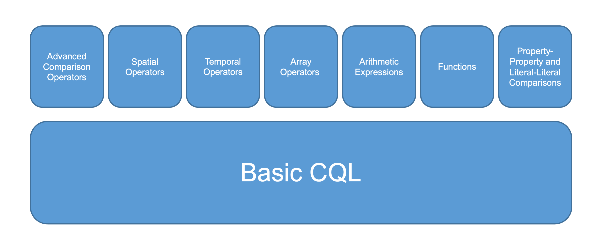

# OGC API - Features - Part 3: Filtering and the Common Query Language (CQL)

This folder contains the content for the candidate standard [OGC API - Features - Part 3: Filtering and the Common Query Language (CQL)](https://portal.ogc.org/files/96288).

## Status

The candidate standard is in the [OGC public comment period](https://www.ogc.org/standards/requests/229). Candidate standards of the OGC API Features series are all developed from the beginning in public GitHub repositories and welcome public comments at any time. This period is the last step in the OGC process before submitting the candidate standard to the OGC Technical Committee for the approval process - after the comments received during the public comment period have been resolved.

The public comment period for candidate standards of the OGC API Features series is at least two months (instead of the 30-day period that OGC normally uses) to allow for feedback from implementations. The public comment period of this candidate standard officially ends on April 19, 2021. However, the OGC Features API SWG has decided to extend the public comment period until at least May 31, 2021, because server implementations implementing public comment period baseline (version "1.0.0-draft.2") that can be used to test client implementations only become available during April 2021. If more time is needed for testing, please let us know ([GitHub issue](https://github.com/opengeospatial/ogcapi-features/issues/367) or [Gitter](https://gitter.im/opengeospatial/WFS_FES)).

The issues are managed in a [GitHub project board](https://github.com/opengeospatial/ogcapi-features/projects/4).

## Overview

The candidate standard specifies three query parameters that can be used to select a subset of the features:

- `filter`: The filter expression, like a WHERE clause in SQL.
- `filter-lang`: The language of the filter expression. The candidate standard specifies the Common Query Language (CQL) and two encodings for filter expressions - a text grammar (`cql-text`, the default) and a JSON representation (`cql-json`).
- `filter-crs`: By default, all geometries in filter expressions are in the coordinate reference system WGS 84 (longitude, latitude, optional height). If the geometries in the filter expression are in a different coordinate reference system, that coordinate reference system is specified in this parameter. It must be one of the coordinate reference systems that is supported by the API for the feature collection as declared in the [`crs` property of the Collection](https://docs.opengeospatial.org/is/18-058/18-058.html#crs-discovery).

A simple example: Select all roads (attribute F_CODE is AP030) that are motorways (attribute RTY is 1 or 2) that have been changed (attribute ZI001_SDV) after 2011. Filter expression in CQL Text: [`F_CODE='AP030' AND RTY IN (1,2) AND ZI001_SDV AFTER 2011-12-31T23:59:59Z`](https://demo.ldproxy.net/daraa/collections/TransportationGroundCrv/items?filter=F_CODE%3D%27AP030%27%20AND%20ZI001_SDV%20AFTER%202011-12-31T23%3A59%3A59Z%20AND%20RTY%20IN%20(1%2C2)).

Examples for CQL expressions in both CQL Text and CQL JSON are available in the [examples folder](standard/schema/examples).

CQL supports filter predicates for standard data types like strings, numbers and boolean as well as for spatial and temporal geometries. Every CQL implementation must support a subset of CQL ("Simple CQL") with more advanced capabilities (array operators, more spatial and temporal operators, functions, arithmetic expressions) in separate conformance classes that can be supported, if needed. The conformance classes supported by an API can be determined by inspecting the [Conformance Declaration](http://www.opengis.net/doc/IS/ogcapi-features-1/1.0#_declaration_of_conformance_classes).

## Filtering capabilities specified in other parts of OGC API Features

Part 1 (Core) specifies minimal filtering capabilities that almost everyone will need when sharing geospatial feature data via an API:

- [spatial filtering](http://www.opengis.net/doc/IS/ogcapi-features-1/1.0#_parameter_bbox) (`bbox`): selecting features in a bounding box in WGS 84
- [temporal filtering](http://www.opengis.net/doc/IS/ogcapi-features-1/1.0#_parameter_datetime) (`datetime`): selecting features at a time instant or for a time interval
- [attribute filtering](http://www.opengis.net/doc/IS/ogcapi-features-1/1.0#_parameters_for_filtering_on_feature_properties): selecting features by value for selected properties (optional)
- every filter is combined with a logical `AND`

An example: [https://demo.ldproxy.net/daraa/collections/CulturePnt/items?datetime=../2012-12-31T23:59:59Z&bbox=36.0,32.6,36.1,32.7&F_CODE=AL030](https://demo.ldproxy.net/daraa/collections/CulturePnt/items?datetime=../2012-12-31T23:59:59Z&bbox=36.0,32.6,36.1,32.7&F_CODE=AL030)

Part 2 (Coordinate Reference Systems by Reference) adds support for other coordinate reference systems that can be used in the `bbox` parameter through a [parameter `bbox-crs`](https://docs.opengeospatial.org/is/18-058/18-058.html#_parameter_bbox_crs).

These filtering capabilities can be combined with the capabilities specified in Part 3. All filter expressions are combined with `AND`.

## Implementations available for testing

To be added shortly with details of supported conformance classes and any deviations from version "1.0.0-draft.2" for each implementation.
