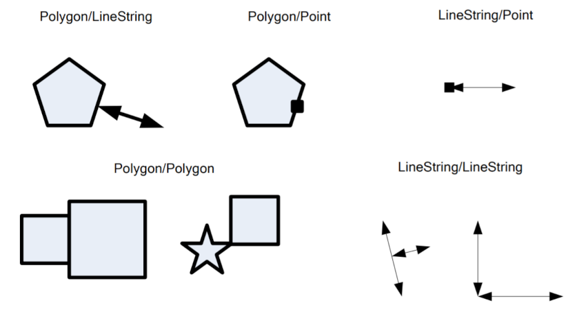
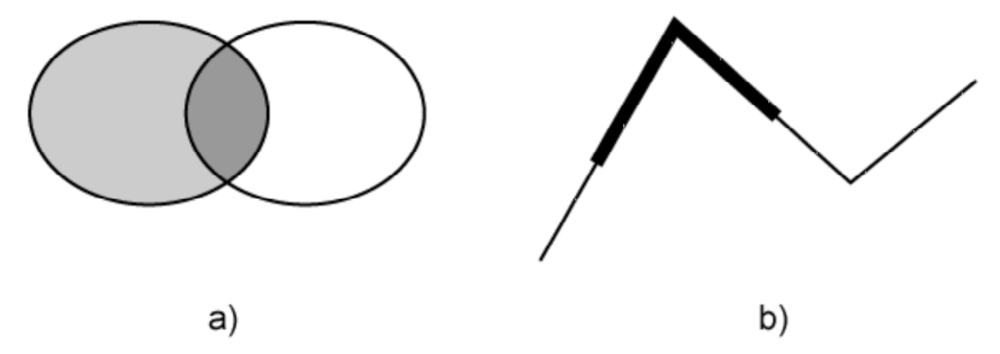
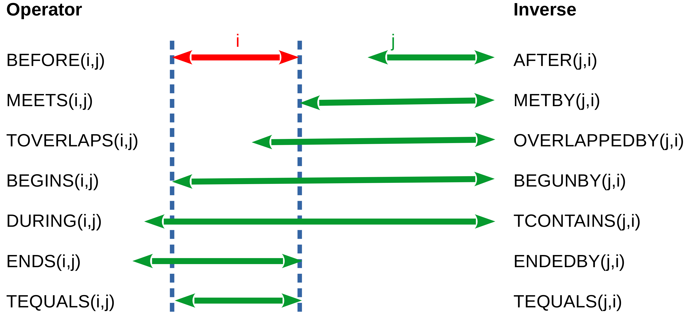

[[cql-enhancements]]
== Common Query Language enhancements

=== Overview

This clause specifies requirements for enhancements to <<cql-core,Simple CQL>>.
Specifically, this clause defines requirements for:

* additional spatial operators
* additional temporal operators
* support for functions in CQL
* support for arithmetic expression in CQL
* support for arrays in CQL

In each case, the clause specifies requirements for the rules in <<cql-bnf>> not 
supported by Simple CQL.

[[enhanced-spatial-operators]]
=== Requirements Class "Enhanced Spatial Operators"

include::requirements/requirements_class_enhanced-spatial-operators.adoc[]

The <<rc_simple_cql,Simple CQL>> clause specifies the use of the `INTERSECTS`
spatial operator.  This requirement adds additional Dimensionally Extended
Nine-intersection Model (DE-9IM) relation operators to the list of spatial
operators that an implementation of this extension might offer.

include::requirements/enhanced-spatial-operators/REQ_enhanced-spatial-operators.adoc[]

The following table lists the mathematical definitions of each spatial operators
as described in <<ISO19125,OpenGIS® Implementation Standard for Geographic information - Simple feature access - Part 1: Common architecture>>.

[reftext='{table-caption} {counter:table-num}']
.Mathematical definitions of spatial operators
[width=80%,cols="30,70",options="header"]
|===
|Spatial operator |Definition
|EQUALS |a EQUALS b &#x2b04; a &#x2286; b &#x2227; b &#x2286; a
|DISJOINT |a DISJOINT b &#x2b04; a &#x2229; b = &#x2205;
|TOUCHES |a TOUCHES b &#x2b04; (I(a) &#x2229; I(b) = &#x2205;) &#x2227; (a &#x2229; b) &#x2260; &#x2205;
|WITHIN | a WITHIN b &#x2b04; (a &#x2229; b = a) &#x2227; (I(a) &#x2229; E(b) &#x2260; &#x2205;)
|OVERLAPS |a OVERLAPS b &#x2b04; (dim(I(a)) = dim(I(b)) = dim(I(a) &#x2229; I(b))) &#x2227; (a &#x2229; b &#x2260; a) &#x2227; (a &#x2229; b &#x2260; b)
|CROSSES |a CROSSES b &#x2b04; [I(a) &#x2229; I(b) = &#x2205;) &#x2227; (a &#x2229; b &#x2260; a) &#x2227; (a &#x2229; b &#x2260; b)]
|INTERSECTS | a INTERSECTS b &#x2b04; ! a DISJOINT b
|CONTAINS | a CONTAINS b &#x2b04; b CONTAINS a
|===

The following diagrams illustrate the meaning of the `TOUCHES`, `WITHIN`, `OVERLAPS`,
and `CROSSES` operators.

[#figure1]
.Examples of the TOUCHES relationship

[#figure2]
.Examples of the WITHIN relationship Polygon/Polygon(a), Polygon/LineString(b), LineString/LineString(c), and Polygon/Point(d)
image::images/within.png[alt=Within,width=70%]

NOTE: If geometry a `CONTAINS` geometry b, then geometry b is `WITHIN` geometry a.

[#figure3]
.Examples of the OVERLAPS relationship Polygon/LineString(a) and LineString/LineString(b)

[#figure4]
.Examples of the CROSSES relationship Polygon/LineString(a) and LineString/LineString(b)
image::images/crosses.png[alt=Crosses,width=70%]

NOTE: Add examples

[[enhanced-temporal-operators]]
=== Requirements Class "Enhanced Temporal Operators"

include::requirements/requirements_class_enhanced-temporal-operators.adoc[]

The <<rc_simple_cql,Simple CQL>> clause specifies the use of the `ANYINTERACTS`
temporal operator.  This requirements class adds additional commonly used temporal
operators that an implementation of this extension might offer.

include::requirements/enhanced-temporal-operators/REQ_enhanced-temporal-operators.adoc[]

CQL supports date and timestamps as time instants, but even the smallest "instant" has a
duration and can be evaluated as an interval, too. For the purposes of determining 
the temporal relationship between two temporal expressions, an instant is treated as
the interval from the beginning to the end of the instant.

The following diagram illustrates the meaning of the temporal operators.

[#figure5]
.The elementary relations between time intervals

NOTE: Add examples

[[functions]]
=== Requirements Class "Functions"

include::requirements/requirements_class_functions.adoc[]

This sub-clause specifies requirements for supporting functions in CQL. Functions
allow implementations to extend the language.

include::requirements/functions/REQ_functions.adoc[]

NOTE: Support for the BNF rule `arithmeticExpression` is added by
the requirements class <<rc_arithmetic,Arithmetic Expressions>>.

A resource, `/functions` is also defined that allows clients to discover the
list of function that a server offers.

include::requirements/functions/REQ_get-functions-operation.adoc[]

include::requirements/functions/REQ_get-functions-response-json.adoc[]

[[example_4]]
.Get functions JSON response example
====
[source,JSON]
----
{
   "functions": [
      {
         "name": "min",
         "arguments": [
            {
               "type": ["string","number","datetime"]
            },
            {
               "type": ["string","number","datetime"]
            },
         ],
         "retuns": ["string","number","datetime"]
      },
      {
         "name": "max",
         "arguments": [
            {
               "type": ["string","number","datetime"]
            },
            {
               "type": ["string","number","datetime"]
            },
         ],
         "retuns": ["string","number","datetime"]
      },
      {
         "name": "geometryType",
         "arguments": [
            {
               "type": ["geometry"]
            }
         ],
         "returns": ["string"]
      }
   ]
}
----
====

NOTE: Add examples

[[arithmetic]]
=== Requirements Class "Arithmetic Expressions"

include::requirements/requirements_class_arithmetic.adoc[]

This clause specifies requirements for supporting arithmetic expressions in CQL.
An arithmetic expression is an expression composed of an arithmetic operand
(a property name, a number or a function that returns a number), an arithmetic
operator (i.e. one of +,-,*,/) and another arithmetic operand.

include::requirements/arithmetic/REQ_arithmetic.adoc[]

NOTE: Support for the BNF rule `function` is added by
the requirements class <<rc_functions,Functions>>.

NOTE: Add examples

[[arrays]]
=== Requirements class "Arrays"

include::requirements/requirements_class_arrays.adoc[]

This clause specifies requirements to support array expression is CQL. Array expressions can 
be tested in a predicate for equality, if one array is a subset of another, if one array 
is a superset of another or if two arrays overlap or share elements.

include::requirements/arrays/REQ_arrays.adoc[]

NOTE: Support for the BNF rule `function` is added by
the requirements class <<rc_functions,Functions>>. 
Support for the BNF rule `arithmeticExpression` is added by
the requirements class <<rc_arithmetic,Arithmetic Expressions>>.
