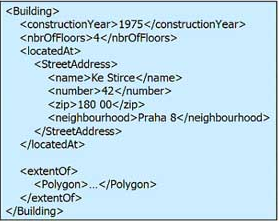
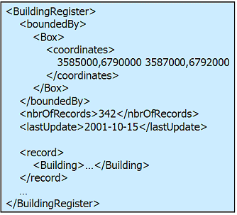
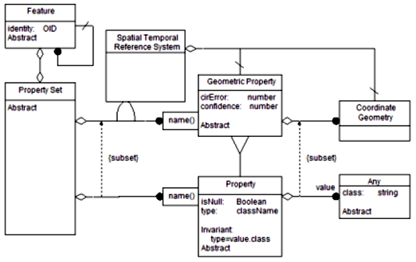
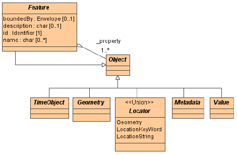
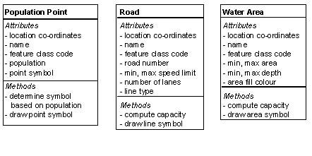
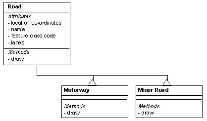
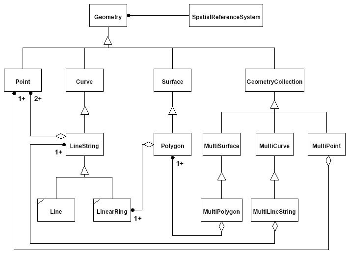

== Introduction to Geospatial

[small]#With thanks to the OGC WFS Cookbook#
[NOTE]
====
The OGC WFS Cookbook was written in 2003. This content will be reviewed and any changes made since then applied.
====

=== The OpenGIS Feature Object Model

WFS is about geographic features. The feature model underlies the ISO  and OGC view of geographic information. The OGC abstract model defines a feature as ?an abstraction of a real world phenomenon? A feature can be:

* An entity (e.g., a mountain, a pond, a city)
* A space (e.g., a postcode area, the tropics).
* A definable location (e.g., a crossroad, as a particular place where two streets intersect).

A Feature will have a number of properties (simple or complex), some of which may be geometric and spatial. The latter is important. In traditional GIS, an item of interest is usually defined as a single geometry ? often a point, line or polygon ? with attributes. In the Feature model the item of interest is a conceptually meaningful phenomenon within the domain of discourse ? such as a Mine, Road or Land-Parcel ? for which one or more properties may be geometric. In a specific feature, the generic ?property? shown in the model would be replaced by several named properties, the values of which would be constrained to be of particular types. The value may be structured, and in some cases may be another feature. A specific Feature Type is defined in terms of this set of named properties that are associated with that type . A Feature instance is thus the functional map of its property values. See Figure 5 for an example of features and its properties.

The Feature model also has Feature Collection, which is a collection of Features together with a bounding Box element that bounds the set of Features. There is no limit to the number of features that can be contained in a FeatureCollection; it can contain other features and Feature Collections. A Feature Collection must have a boundedBy property. All features inside a FeatureCollection would have homogeneous simple properties. One of those properties is typically the geometry of the feature. Geometric Property contains Geometry: Point, LineString, Polygon, (Multi-), Box. See Figure 6 for an example of Feature Collection.

Feature Collections may or may not have useful identity in themselves. It all depends on how the data producer has constructed an application schema.  Feature Collections can correspond to traditional GIS layers, and as such can have properties like metadata or like a minimum bounding rectangle (MBR), which must be re-computed if one only queries for the members of the feature collection.  Feature Collections can also correspond to tiles in a data set that has been segmented to deal with large data volumes. In both cases, the gml:id of the feature collection becomes a key bit of info for a WFS client.

[.text-center]
Figure 5: Feature and Properties

[.text-center]
Figure 6: Feature Collection

Figure 7 shows the OpenGIS Feature Model. The single-hash mark across a relationship link indicates a derived association. For example, a Coordinate Geometry is dependent on the Reference System specified. Another example is that one Feature can be derived from another Feature. The triangle at one end of a relationship link indicates a subtype relationship. That is, the Geometric Property object is a subtype of the Property object. A small rectangle with a label inside that is at one end of a relationship link indicates a named relationship. For example, a Property Set has one or more Geometric Properties, each of which must be identified by a name. There is also a subset relationship, which here means that Geometric Properties make up a subset of all Properties, and that Coordinate Geometry makes up a subset of any other kinds of Properties.

[.text-center]
Figure 7: OpenGIS Feature Object Model

Each object has a unique identifier (Object ID or OID), which is assigned and maintained by the system. This results in much more efficient selection, comparison, and other processing of objects in queries and analysis. This is in contrast with relational database systems, in which a record ID is unique within a single table.

*Figure 8* shows the basic example of an abstract feature model. To describe an object using the feature model, its "type" or the "class" to which it belongs is determined first. This fixes what properties are associated with it, one or more of which may be geometric. The major advantage in thinking in terms of objects is that features can be abstracted at a higher level. A class of ?road? is an Abstract Data Type (ADT), a higher semantic level than the integers, strings, record-sets or records used before.

[.text-center]
Figure 8: OpenGIS Feature (abstract)

An example of a concrete feature type class (i.e., Road) is shown in Figure 9.

image::images/Cookbook_Figure_9.png[Figure 9]

[.text-center]
Figure 9: Road Feature

The geospatial context is also important and usually one or more of the properties concerns geometry, for example, a road will have a shape whose value is a ?Curve.? The original meaning of the word geometry denotes a branch of mathematics. Another meaning comes from cartography, referring to the geometric features that cartographers use to map the world. Geometry can be defined as a point or an aggregate of points representing anything in the world that has a location.

*Figure 10* shows some class definitions that might be found in a geographical database. Notice each of these classes has attributes and methods for locational, graphical, and analytical purposes. The attribute which describes the shape and location is often called ?geometry? (**described in detail in Section 1.2.2, The OpenGIS Geometry Object Model**) and is a special basic type which automatically and invisibly links into the underlying spatial indexing system.

[.text-center]
Figure 10: Geographic Feature Classes

Figure 11 shows how sub-classing can be used to set up two different visual representations for the different types of ?Road? class. Each sub-class has a different display method ?draw?. Notice that each sub-class inherits all the other attributes and methods from the super-class and so does not need to redefine them. This could alternatively be designed with only one class, an attribute specifying the type of road, and a display method which had a list of ?if? statements on that road-type attribute (note that this is not so robust for extensions).

[.text-center]
Figure 11: Object-Oriented Inheritance

=== The OpenGIS Geometry Object Model

In 1997, OGC published the OpenGIS Simple Features Specifications for SQL , which describes a set of SQL geometry types, as well as functions on those types to create and analyze geometry values. In addition, it proposes several conceptual ways for extending an SQL RDBMS to support spatial data.

*Figure 11* shows the OpenGIS geometry object model

[.text-center]
Figure 12: OpenGIS Geometry Object Model

The OpenGIS geometry class has the following hierarchy:

  o Geometry (non-instantiable)
    o Point (instantiable)
    o Curve (non-instantiable)
        ? LineString (instantiable)
        ? Line
        ? LinearRing
    o Surface (non-instantiable)
        ? Polygon (instantiable)
    o GeometryCollection (instantiable)
        ? MultiPoint (instantiable)
        ? MultiCurve (non-instantiable)
            o MultiLineString (instantiable)
        ? MultiSurface (non-instantiable)
            o MultiPolygon (instantiable)

Some of these classes are abstract (non-instantiable). That is, it is not possible to create an object of these classes. Other classes are instantiable and objects may be created of them. Each class has properties and instantiable classes may have assertions (rules that define valid class instances). Geometry, Curve, Surface, MultiCurve, and MultiSurface are defined as non-instantiable classes. They define a common set of methods for their subclasses and are included for the reason of extensibility. Point, LineString, Polygon, GeometryCollection, MultiPoint, MultiLineString, and MultiPolygon are instantiable classes.

==== The Geometry Class

Geometry is the base class and it is an abstract class. The instantiable subclasses of Geometry are restricted to zero-, one-, and two-dimensional geometric objects that exist in two-dimensional coordinate space. All instantiable geometry classes are defined so that valid instances of a geometry class are topologically closed (that is, all defined geometries include their boundary). A geometry value has the following properties:

* Its type. Each geometry belongs to one of the instantiable classes in the hierarchy.

* Its SRID, or Spatial Reference Identifier. This value identifies the geometry's associated Spatial Reference System that describes the coordinate space in which the geometry object is defined.

* Its coordinates in its Spatial Reference System, represented as double-precision (8-byte) numbers. All non-empty geometries include at least one pair of X,Y coordinates. Empty geometries contain no coordinates. Coordinates are related to the SRID. For example, in different coordinate systems, the distance between two objects may differ even when objects have the same coordinates, because the distance on the planar coordinate system and the distance on the geocentric system (coordinates on the Earth's surface) are different things.

* Its interior, boundary, and exterior. All geometries occupy some position in space. The exterior of a geometry is all space not occupied by the geometry. The interior is the space occupied by the geometry. The boundary is the interface between geometry's interior and exterior.

* Its MBR (Minimum Bounding Rectangle), or Envelope. This is the bounding geometry, formed by the minimum and maximum (X,Y) coordinates: ((MINX MINY, MAXX MINY, MAXX MAXY, MINX MAXY, MINX MINY))

* The quality of being simple or non-simple. Geometry values of some types (LineString, MultiPoint, MultiLineString) are either simple or non-simple. Each type determines its own assertions for being simple or non-simple.

* The quality of being closed or not closed. Geometry values of some types (LineString, MultiString) are either closed or not closed. Each type determines its own assertions for being closed or not closed.

* The quality of being empty or not empty. A geometry is empty if it does not have any points. Exterior, interior and boundary of an empty geometry are not defined (that is, they are represented by a NULL value). An empty geometry is defined to be always simple and has an area of 0.

* Its dimension. A geometry can have a dimension of -1, 0, 1, or 2:

  o	-1 stands for empty geometries.
  o	0 stands for geometries with no length and no area.
  o	1 stands for geometries with non-zero length and zero area.
  o	2 stands for geometries with non-zero area.

Point objects have a dimension of zero. LineString objects have a dimension of 1. Polygon objects have a dimension of 2. The dimensions of MultiPoint, MultiLineString, and MultiPolygon objects are the same as the dimensions of the elements they consist of.

The base Geometry class has subclasses for Point, Curve, Surface and GeometryCollection, which are explained below.

==== The Point Class

A Point represents zero-dimensional objects. A Point is a geometry that represents a single location in coordinate space. Point properties are:

* X-coordinate value.
* Y-coordinate value.
* Point is defined as a zero-dimensional geometry.
* The boundary of a Point is the empty set.

==== The Curve Class

A Curve represents one-dimensional objects. Its geometry is usually represented by a sequence of points. Particular subclasses of Curve define the type of interpolation between points. Curve is a non-instantiable class. Curve has subclass LineString, with sub-subclasses Line and LinearRing. Curve properties are:

* The coordinates of its points.
* Curve is defined as one-dimensional geometry.
* A Curve is simple if it does not pass through the same point twice.
* A Curve is closed if its start point is equal to its end point.
* The boundary of a closed Curve is empty.
* The boundary of a non-closed Curve consists of its two end points.
* A Curve that is simple and closed is a LinearRing (i.e., rivers, roads).

==== The LineString Class

A LineString is a Curve with linear interpolation between points. LineString properties are:

* Coordinates of LineString segments, defined by each consecutive pair of points.
* A LineString is a Line if it consists of exactly two points.
* A LineString is a LinearRing if it's both closed and simple.

==== The Surface Class

A Surface is designed for two-dimensional objects and has subclass Polygon. Surface properties are:

* A Surface is defined as a two-dimensional geometry.
* A simple Surface is a geometry that consists of a single ``patch'' that is associated with a single exterior boundary and zero or more interior boundaries.
* The boundary of a simple Surface is the set of closed curves corresponding to its exterior and interior boundaries.

==== The Polygon Class

A Polygon is a simple geometry made up of the following assertions:

* The boundary of a Polygon consists of a set of LinearRings (that is, LineStrings that are both simple and closed) that make up its exterior and interior boundaries.
* No two rings in the boundary cross. The rings in the boundary of a Polygon may intersect at a Point, but only as a tangent.
* A Polygon may not have cut lines, spikes, or punctures.
* The interior of every Polygon is a connected point set.
* The exterior of a Polygon with one or more holes is not connected. Each hole defines a connected component of the exterior.

==== The GeometryCollection Class

A GeometryCollection has specialized zero-, one-, and two-dimensional collection classes named MultiPoint (i.e., chain of small islands), MultiLineString (i.e., a river or a highway system), and MultiPolygon (i.e., a system of lakes) for modeling geometries corresponding to collections of Points, LineStrings, and Polygons, respectively. MultiCurve and MultiSurface are introduced as abstract superclasses that generalize the collection interfaces to handle Curves and Surfaces. All the elements in a GeometryCollection must be in the same Spatial Reference System (that is, in the same coordinate system). GeometryCollection places no other constraints on its elements, although the subclasses of GeometryCollection described in the following sections may restrict membership. Retrictions may be based on:

* Element type (for example, a MultiPoint may contain only Point elements)
* Dimension
* Constraints on the degree of spatial overlap between elements

==== The GeometryCollection Class

A MultiPoint is a geometry collection composed of Point elements. The points are not connected or ordered in any way. MultiPoint properties are:

* MultiPoint is defined as a zero-dimensional geometry.
* A MultiPoint is simple if no two of its Point values are equal (have identical coordinate values).
* The boundary of a MultiPoint is the empty set.

==== The MultiCurve Class

A MultiCurve is a geometry collection composed of Curve elements. MultiCurve is a non-instantiable class. MultiCurve properties are:

* A MultiCurve is simple if and only if all of its elements are simple, the only intersections between any two elements occur at points that are on the boundaries of both elements.
* The boundary of a MultiCurve is obtained by applying the ``mod 2 union rule'' (also known as the odd-even rule): A point is in the boundary of a MultiCurve if it is in the boundaries of an odd number of MultiCurve elements.
* A MultiCurve is closed if all of its elements are closed.
* The boundary of a closed MultiCurve is always empty.

==== The MultiSurface Class

MultiSurface is a geometry collection composed of surface elements. MultiSurface is a non-instantiable class. Its only instantiable subclass is MultiPolygon. Its assertions are:

* The interiors of any two surfaces in a MultiSurface may not intersect.
* The boundaries of any two elements in a MultiSurface may intersect at most at a finite number of points.

==== The MultiSurface Class

MultiPolygon is a MultiSurface object composed of Polygon elements. Its assertions are:

* The interiors of two Polygon values that are elements of a MultiPolygon may not intersect.
* The boundaries of any two Polygon values that are elements of a MultiPolygon may not cross and may touch at only a finite number of points. (Crossing is also forbidden by the preceding assertion).
* A MultiPolygon may not have cut lines, spikes or punctures. A MultiPolygon is a regular, closed point set.
* The interior of a MultiPolygon composed of more than one Polygon is not connected. The number of connected components of the interior of a MultiPolygon is equal to the number of Polygon values in the MultiPolygon.

MultiPolygon properties are:

* A MultiPolygon is defined as a two-dimensional geometry.
* The boundary of a MultiPolygon is a set of closed curves (LineString values) corresponding to the boundaries of its Polygon elements.
* Each Curve in the boundary of the MultiPolygon is in the boundary of exactly one element Polygon.
* Every Curve in the boundary of an element Polygon is in the boundary of the MultiPolygon.
