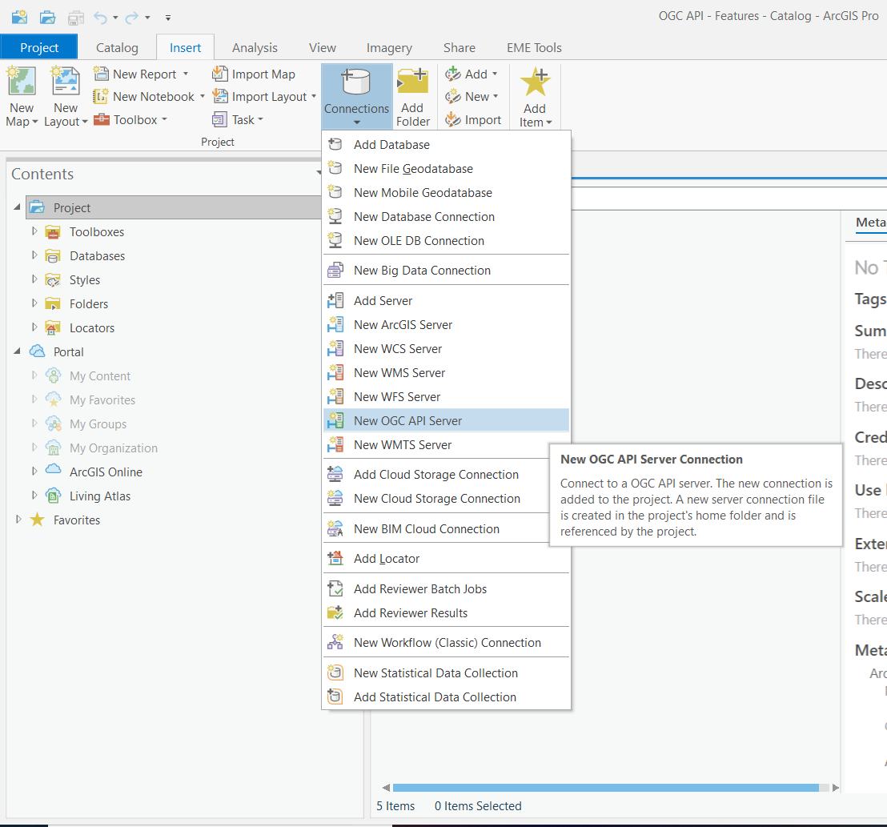
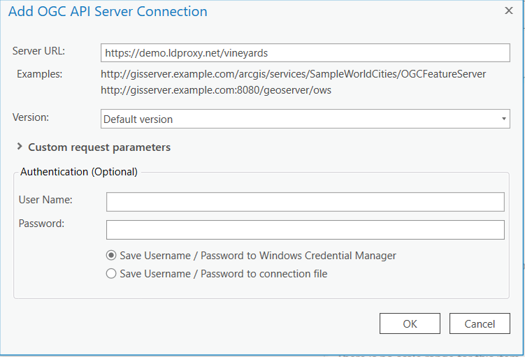
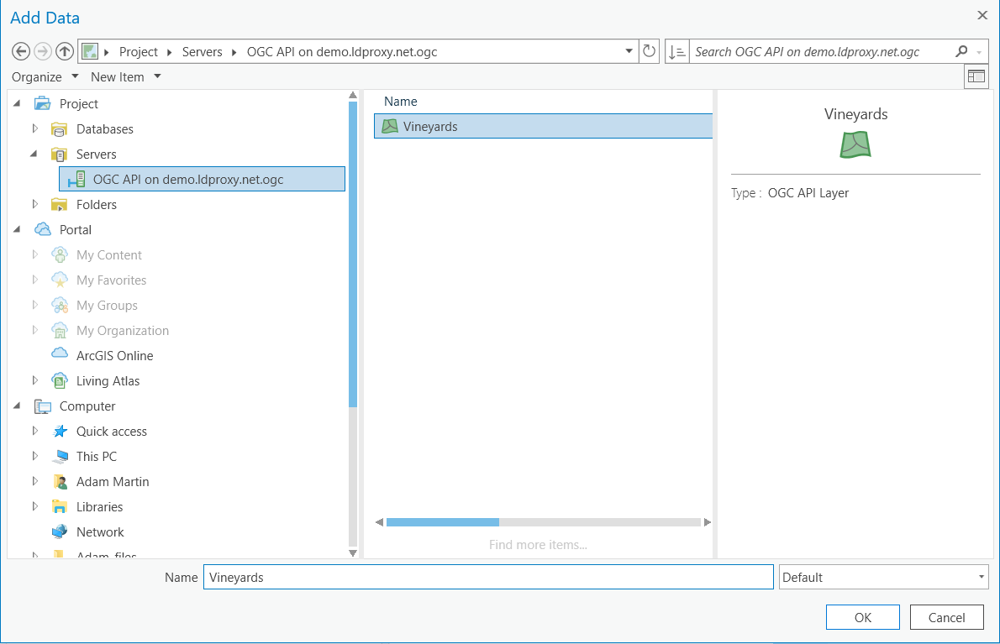
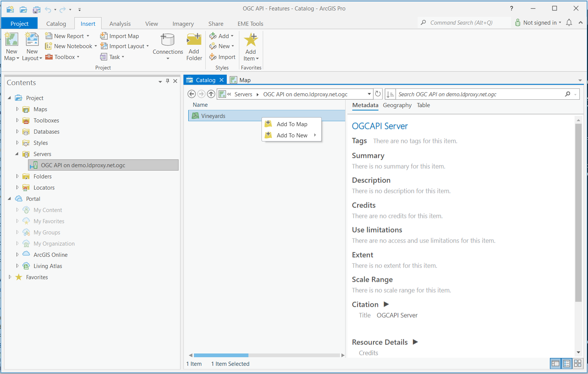
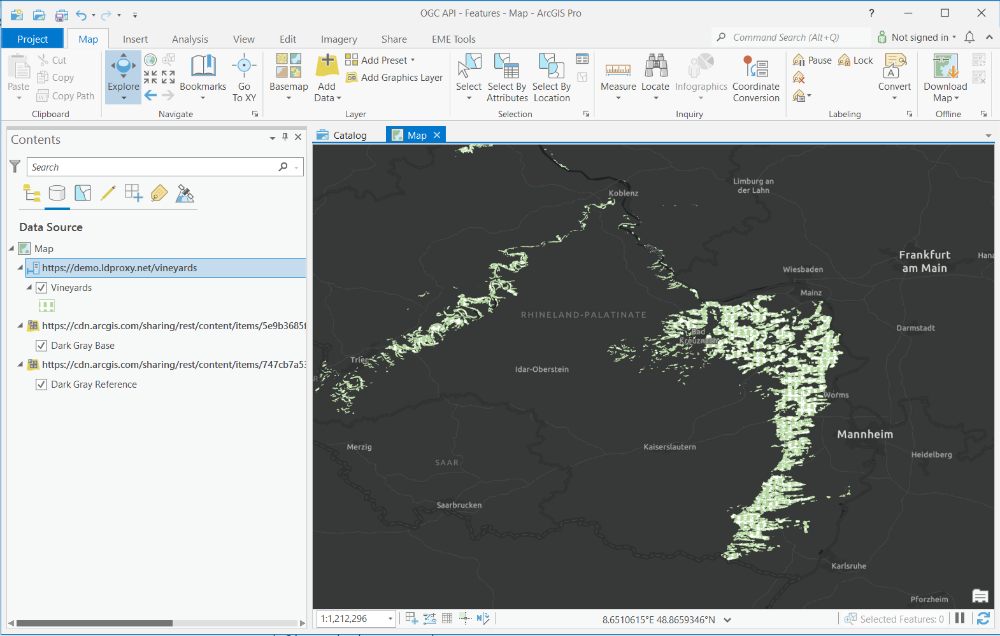

# ArcGIS Pro

This page shows how to connect with ArcGIS Pro to an API that implements OGC API - Features - Part 1: Core. 

## Links to Updated Documentation
* [Add OGC API - Features Services in ArcGIS Pro](https://pro.arcgis.com/en/pro-app/latest/help/data/services/add-ogc-api-services.htm)
* [Use  OGC API - Features services in ArcGIS Pro](https://pro.arcgis.com/en/pro-app/latest/help/data/services/use-ogc-api-services.htm)

## Software version

This description uses Pro 2.8+

## Required and supported Conformance classes

The API must support the [Core](http://www.opengis.net/spec/ogcapi-features-1/1.0/conf/core) and [GeoJSON](http://www.opengis.net/spec/ogcapi-features-1/1.0/conf/geojson) conformance classes.

The CRS conformance class from Part 2 (Coordinate Reference Systems by Reference) is not supported. 
<!-- ArcGIS Pro, however, transforms the WGS84 geometries returned from the API to other coordinate reference systems as needed. -->

## Steps

### Step 1: Add an OGC API server connection

On the Insert tab, in the Project group, click the Connections drop-down list and click New OGC API Server.
The Add OGC API Server Connection dialog box appears.

Enter the URL of the OGC API server site you want to connect to in the Server URL text box (e.g. https://demo.ldproxy.net/vineyards). The URL may vary depending on the site configuration.

If the OGC API service you are connecting to has additional capabilities or requires a special key-value pair (for example, an api key), you can add custom request parameter names and values to the Custom request parameters section. Be aware that ArcGIS Pro cannot validate these additional parameters.
Type your user name and password if appropriate.

Click OK.

An OGC API connection file (.ogc) is created and saved in the project's home folder. An item referencing this connection file is added to the project, and the connection appears in the Servers folder on the Project tab of the Catalog pane.

### Step 2: Adding collections to a Map

There are two ways to add data to a map to begin visualizing and using the features. 

From the Map View window, click the "Add Data" button within the Map tab at the top. In the Data catalog pane on the left hand side, expand the *Servers* folder to see the newly added OGC API connection. This will allow you to view the layers (aka. "collections") present on the OGC API server. 

Select the collections that should be added to the project as a layer and press "OK". 

From the Catalog window, go to the Contents catalog pane on the left hand side, expand the *Servers* folder within the Project section to see the newly added OGC API Server connection.

Right-click a layer and click either Add to new map or Add to current map to add a layer to the map. You can also add the service to the map by dragging it onto the map or into the Contents pane.

The features within the collection should now appear in the map centered around the features.

### Step 3: Use the features

The features from the selected collections should now be added to the map.

When an OGC API Features layer has been added to ArcGIS Pro, it behaves as a read-only feature layer. For example, you can open the attribute table to view the records in the layer, query features in the map, or change the symbology of the layer. Since the OGC API Features layer is not editable, you cannot make edits to the data or schema through ArcGIS Pro. If the number of features in a layer is higher than the page size, the features are progressively loaded page by page.

Note that, if a collection has millions of features and the map view covers the extent of the collection, ArcGIS Pro will try to load all features. To avoid this, you can, for example, restrict the scale range in which the layer should be visible.

