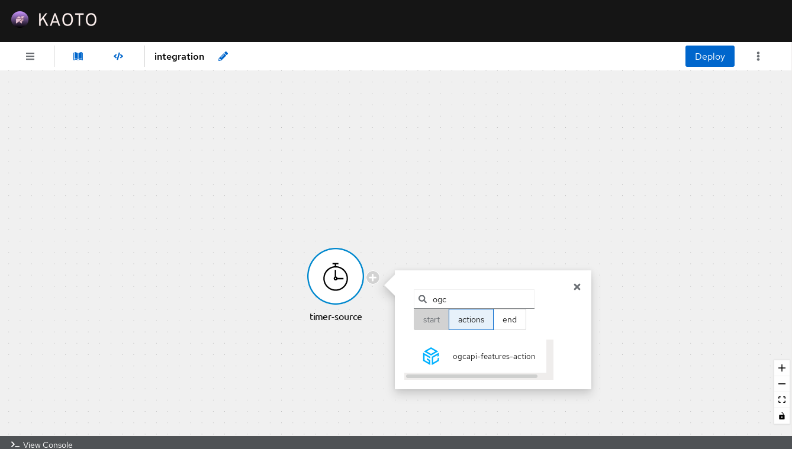
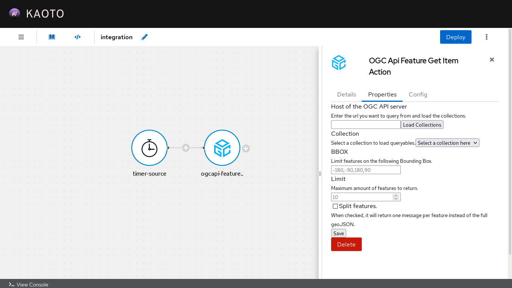
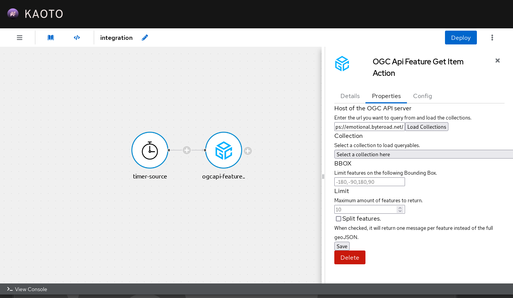
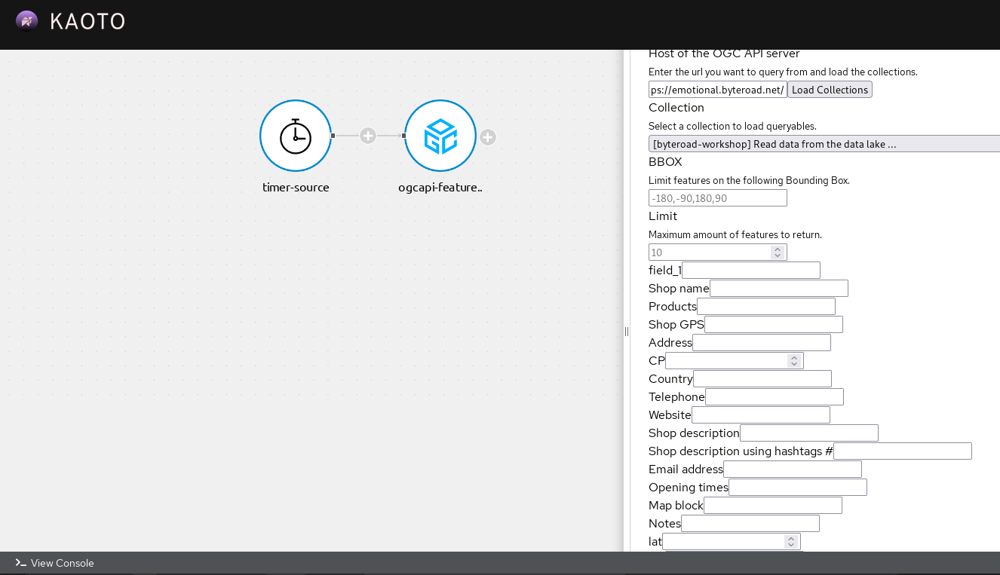

# Kaoto

This page shows how to connect with Kaoto to an API that implements OGC API - Features - Part 1: Core to query features.

## Steps

### Step 0: Using Kaoto

You must have a running instance of [Kaoto](https://kaoto.io) that supports the [OGCAPI Features Action](https://camel.apache.org/camel-kamelets/next/ogcapi-features-action.html) (version 0.9+ of the kamelet catalog).

Check the [quickstart](https://kaoto.io/quickstart/) for more information.

### Step 1: Add a step of type OGC API - Features

The OGC API - Features is an intermediate step. You can add it by clicking on one of the `+` buttons on the graphic side.

This will add a new step in the workflow. Clicking on this step will open the configuration tab on the right side of the application.

### Step 2: Loading and selecting the collection

After filling the server url, you can click on `Load Collections` button to populate the dropdown collections field.

Select the collection you want to extract the features from.

### Step 3: Use the queryables to filter

After selecting the collection, the form will be populated with all the available fields you can use in your query.

Once the relevant fields are filled, you can click on the `Save` button at the end of the configuration and the step will be prepared to be deployed in the workflow.
