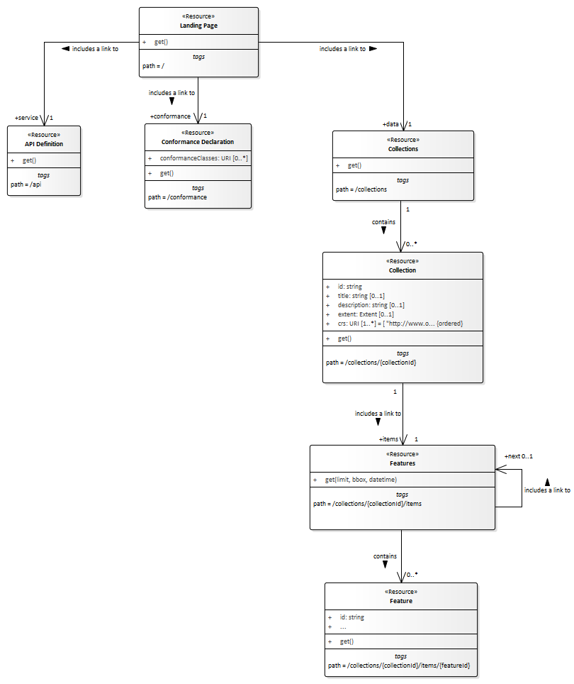
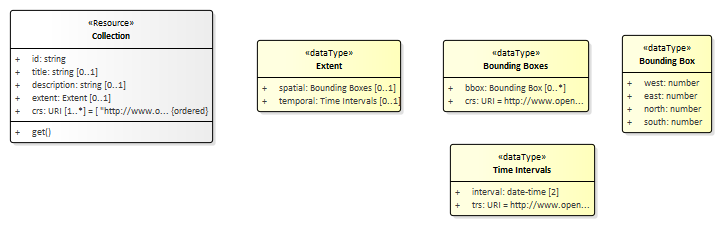
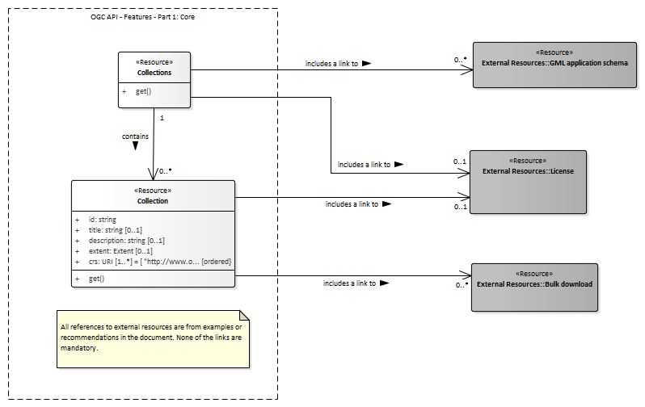

# UML

As part of the work on the Core standard, an informative UML model
for the resources specified in the specification has been developed
(see [#217](https://github.com/opengeospatial/ogcapi-features/issues/217)
for details).

It uses a simple UML profile with two stereotypes/keywords:

* `Resource` for each resource type identified by a URI or
URI template in the specification;
* `dataType` for each object used in the response schemas.

Three class diagrams are shown below. The model itself is available
as an Enterprise Architect [EAP file](ogc-api-features-core.eap) and
as an [XMI 1.1 file](ogc-api-features-core.xml) exported from
Enterprise Architect.

## Resources specified in Part 1: Core

Note that the path parameters `collectionId` and `featureId` are
the `id` properties from the `Collection` and `Feature` resources
respectively.

## Data types specified in Part 1: Core

## Links to external resources

